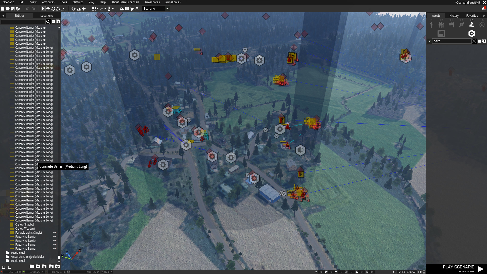
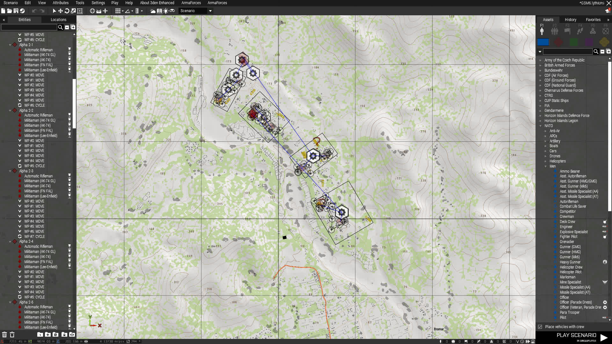

Oto poprawiony tekst:

# Od zera do missionmakera

Chciałbym, aby każdy kto chce tworzyć misje, posiadał jak najwięcej iformacji w jednym miejscu. I robił fajne misje jak ja (DDOS) :)

## Wprowadzenie

To jest poradnik, którego celem jest pokazanie, jak rozpocząć przygodę w tworzeniu misji, bez poczucia zagubienia.

W tym poradniku omówię:

- Co warto zaistalować, gdzie zaoglądać i czego się wystrzegać przy szukaniu "jak coś zrobić".
- Ogólny sposób używania edytora i co warto zrobić po pierwszym uruchomieniu.
- Attributes, moduły które w edytorze są najcześciej wykorzystywane + triggerki + najprostrze wykorzystanie simple spawnów/build spawnów z MAI-a.
- Wyjaśnienie presetu.
- Co można robić by mieć jak największe szanse osiągnąć dobre fps-y.
- Na co zwracać uwagę w ogólnym tworzeniu misji, co pomaga, czego unikać i co zwykle nie ma sensu
- Ogólne Zeusowanie, problemy i rozwiązania
- Wprowadzenie do skryptów w armie.
- Czym jest lokalność i dlaczego jest to coś na co zawsze trzeba uważać.
- Dlaczego CBA jest fajne i co warto z niego wiedzieć.
- Pisanie tasków
- Wygląd kilku misji w edytorze. Co chciałem osiągnąc i co było skryptowane na misji.

Chciałbym zaznaczyć, że nie jestem ekspertem w tej dziedzinie, więc ten poradnik zawierać będzie uproszczenia i niedopowiedzenia, które będziesz musiał samodzielnie zrozumieć. Zachęcam do dzielenia się uwagami i poprawkami.

## 1. **Co warto zainstalować, gdzie szukać informacji i na co uważać, gdy próbujesz dowiedzieć się "jak coś zrobić"**

Aby stworzyć ogólną misję, która pozwoli nam wszystkim grać, wystarczy w zasadzie sama Arma wraz z presetem. [Preset](https://discord.com/channels/386882491484602368/541577429010087937) to gotowa misja, która zawiera podstawową strukturę plików misji, na której będziesz pracować.

Poniżej znajdziesz programy, linki i mody, które w wielu przypadkach mogą nie być konieczne, ale warto z nimi się zapoznać, aby w przyszłości łatwiej znaleźć potrzebne informacje.

### **Strony internetowe**

Podczas tworzenia misji spędzisz dużo czasu na przeglądaniu stron internetowych, takich jak:

- [Google](https://www.google.com/) - aby sprawdzić, czy ktoś gdzieś nie opublikował prostego skryptu, którego potrzebujesz. Wiele wyników przekieruje cię do Forum Bohemia i Wiki Army.
- [Wiki Army](https://community.bistudio.com/wiki/Category:Scripting_Commands) - Każdy skrypt, który znajdziesz na Google, opiera się na komendach dostępnych tutaj. Większość z nich jest szczegółowo opisana, z przykładami zastosowania i uwagami społeczności.
- [Kanały "mission_making" na naszym discordzie](https://discord.com/channels/386882491484602368/590073885362487306) - Służą podobnym celom co Google. Możesz tam zadawać pytania, a ktoś kiedyś na pewno na nie odpowie. Warto pytać, jeśli wyniki w Google nie są jasne lub masz wątpliwości, niezależnie od tego, czy dotyczy to skryptów, koncepcji czy możliwości osiągnięcia czegoś.
- [Wiki CBA](https://cbateam.github.io/CBA_A3/docs/index/General.html) - CBA zawiera kilka przydatnych rzeczy często wykorzystywanych w podstawowych skryptach, opisanych w sekcji poświęconej skryptom.
- [ACE Functions Wiki](https://ace3.acemod.org/wiki/functions/) - ACE jest na zdecydowanej większości misji i dodaje wiele usprawnień oraz funkcji, których brakuje w wersji podstawowej Army (głównie po to, by irytować Krystola). Zajrzyj tutaj, aby dowiedzieć się, jak stworzyć skrypt leczący gracza ACE Medical na misji.
- Githuby/inne odpowiedniki - wiele potrzebnych rzeczy już zostało napisanych i użytych przez kogoś wcześniej. Zazwyczaj, po zadaniu pytania, otrzymasz link do funkcji lub kodu, który spełnia twoje potrzeby.
- Tutoriale dotyczące skryptowania - [Poradniki Bohemiove: ](https://community.bistudio.com/wiki/Category:Arma_Scripting_Tutorials), [Przewodnik Ace Coding](https://ace3.acemod.org/wiki/development/coding-guidelines), [Poradnik Acre](https://acre2.idi-systems.com/wiki/development/coding-guidelines-sqf)

### **Mody**

W trakcie tworzenia misji na swojej liście modów NALEŻY mieć:

- [3denEnhanced](https://steamcommunity.com/workshop/filedetails/?id=623475643) - Dodaje wiele przydatnych narzędzi, które przyspieszają i ułatwiają tworzenie misji.
- [ZeusEnhanced](https://steamcommunity.com/workshop/filedetails/?id=1779063631) - Rozbudowuje i ułatwia wiele aspektów zeusowania.
- [MAI-Dev](https://steamcommunity.com/sharedfiles/filedetails/?id=1852213757) - Simple spawny, Build Spawny i twory Madina (które na ogół są wyłączone na serwerze) mogą znacząco zoptymalizować misje. Ten mod jest opcjonalny. Zwyczajnie jednak łatwo z jego pomocą zachować ładne fps-y

Opcjonalne, ale czasem przydatne mody z Warsztatu:

- [Deformer](https://steamcommunity.com/sharedfiles/filedetails/?id=2822758266) - Pozwala edytować teren w edytorze na potrzeby misji.
- [ZEI-Zeus and Eden Interiors](https://steamcommunity.com/sharedfiles/filedetails/?id=1251859358) - Dodaje moduł, który wypełnia budynki meblami oraz zapełnia podłogi/stoliki.
- [Emitter 3Ditor](https://steamcommunity.com/sharedfiles/filedetails/?id=1613905318) - Przydatny, gdy chcesz dodać efekty cząsteczkowe do swoich skryptów (bardzo zaawansowane).
- Kompozycje budynków, takie jak:
  - [ZEC - Zeus and Eden Templates / Building Compositions](https://steamcommunity.com/sharedfiles/filedetails/?id=642912021)
  - [ZECCUP - Zeus and Eden Templates for CUP Terrains](https://steamcommunity.com/sharedfiles/filedetails/?id=750186990)
- [O&T Expansion Eden](https://steamcommunity.com/sharedfiles/filedetails/?id=1923321700) - Mod dodający vanillove obiekty, które zazwyczaj są trudno dostępne, np. modele piorunów, drzewa.
- [Snapping for Eden and Zeus](https://steamcommunity.com/sharedfiles/filedetails/?id=2961167812) - Przydatny, gdy tworzysz własne miasta z wieloma płotami i obiektami. Będą starać się dopasować do innych obiektów wokół nich.

UWAGA: Podczas tworzenia misji lepiej unikać "opcjonalnych" modów. JSRS może zostawić ślad w pliku misji, a potem okaże się, że mod jest wymagany. To nie jest coś, co całkowicie psuje misję, ale wprowadza niepotrzebny krok, aby uruchomić misję poprawnie na serwerze.

### **Programy**

W przypadku prostych misji można spokojnie używać edytora Armowego oraz notatnika lub Notepad++. Jednak w przypadku bardziej zaawansowanych projektów, z pewnością docenisz narzędzia, które pomogą w efektywnym pisaniu skryptów:

- [Visual Studio Code](https://code.visualstudio.com/) - Program do pisania kodu. Kiedy twoje skrypty zaczynają być dłuższe niż 3 linijki, docenisz fakt, że program ten proponuje komendy, koloruje czcionkę zależnie od typu danych, oraz podpowiada, gdzie zakończyć nawiasy itd.

  - [Rozszerzenie SQF Language](https://marketplace.visualstudio.com/items?itemName=Armitxes.sqf) - Ułatwia pracę z SQF (Scripting Language używanym w Armie).
- Jakiś klient FTP, który pozwoli na łatwe przesyłanie plików na serwer, np. [WinSCP](https://winscp.net/eng/download.php).

### **Czego unikać przy szukaniu informacji na temat "jak coś zrobić"**

Unikaj długich skryptów. W rzadkich przypadkach to, czego szukasz, będzie wymagało długiego skryptu. Często warto skonsultować się na kanale misji lub z doświadczonym missionmakerem.

Często napotkasz skrypty, które są częścią większych funkcji lub mogą być związane z jakimś modem lub systemem. W takich przypadkach najlepiej jest znaleźć komendy, które prawdopodobnie realizują to, czego szukasz.

Następnie sprawdź, co ta komenda robi w Wiki Army3 i spróbuj ją zastosować w sposób, który spełnia Twoje oczekiwania.

Dzięki takim działaniom zdobywasz doświadczenie i zrozumienie, co dana komenda robi, co pozwoli Ci w przyszłości tworzyć bardziej zaawansowane skrypty.

Unikaj skryptów, które często zawierają wyrażenia takie jak` _this select 0`. Jest to ważne z kilku prostych powodów. Jeśli widzisz te wyrażenia wielokrotnie, to znaczy, że kod jest długi. Kiedy ktoś nie zadbał o czytelność i nie użył zrozumiałych nazw zmiennych, staje się to utrudnione do zrozumienia. Ślepe kopiowanie kodu bez zrozumienia jego działania nie jest efektywne ani mądre.

## 2. **Ogólny sposób używania edytora i co warto zrobić po pierwszym uruchomieniu**

Po włączeniu edytora zobaczymy coś takiego


Mimo że jest tu trochę rozwijanych menu które rozwijają się w kolejne opcje to pokaże tylko te rzeczy które są najbardziej używane

### Prawy przybornik


- **F1** -> pojedyńcze jednostki podzielone na przypisanane im bazowo strony, cywile i obiekty

- **F2** -> Kompozycje, Tak samo jak wyżej. Dodatkowo jest jeszcze "CUSTOM" w którym znajdować się będą nasze zapisane kompozycje.

- **F3** ->  Triggerki

- **F4** -> Waypointy, aby jest móc postawić musisz mieć wybraną jakiegoś bota.

- **F5** -> Moduły (zębatka) w które stawiasz na mapie i one coś robią, czy to same czy po aktywacji z triggerem. Później wypisze te najcześciej stosowane. Są też Logic Entities ale z tego raczej nigdy nie skorzystasz. Opisane w dalszej części  

- **F6** -> Markery do stawiania na mapie

W wyszukiwarce na dole można wyszukać jakiś obiekt, kategorie, obiekty z moda (prefix moda można wybrać klikając strzałeczke po lewo)

### **Lewy Przybornik**


Tutaj będą się pokazywać wszystkie stawiane przez nas obiekty.

Guzikami na dole można usunąć puste foldery jeśli jakieś dodaliśmy, ukryć, zrobić nowe, zablokować edycje czy widoczność obiektów w folderze.

### **Pasek u góry i Pasek narzędzi**


#### **Pasek u góry**

Pozwól mi omówić tylko te elementy, które mogą sprawiać trudności lub wymagają uwagi na górnym pasku narzędzi. Przedstawię je w kolejności, zaczynając od góry i wskazując, które z nich są częściej używane. Czasami podam także skróty klawiszowe.

- **Scenario**
  - **Save/Open Mission** - Przy zapisywaniu misji, zalecam odznaczenie opcji "**BINARIZE SCENARIO"**, aby ułatwić rozwiązywanie ewentualnych problemów z wczytywaniem modów po stworzeniu misji z modami których być nie powinno.
  - **MERGE** - Pozwala na połączenie dwóch misji na tej samej mapie. Przydatne, gdy wspólnie tworzy się misje.
- **Edit** - Do tej zakładki nie zajrzysz pratkycznie wcale,wszystkie elementy takie jak odpowiedniki CTRL+Z/Y (Cofnij/Znów) są na na paskach.
- View
  - **Center on Selected entity (F)** - Przydatne, gdy na mapie jest wiele obiektów i próbujesz zlokalizować wybrany obiekt z lewego panelu narzędzi.
  - **Toggle Flashlight (L)** - Włącza latarkę, co pomaga w ciemności, jeśli gra jest ustawiona na noc.
  - **Toggle Vision (N)** - Przełącza tryb widzenia między normalnym, noktowizyjnym a termowizyjnym.
- Attributes
  - **General** - Zawiera ustawienia, które są często ustawiane przez plik presetu. Zazwyczaj nie trzeba niczego zmieniać lub przeglądać w tej sekcji.
  - **Environment** - Zawiera ustawienia dotyczące pogody i mgły. Należy unikać zmiany ustawień "visualsettings", ponieważ są one zawarte w presecie(init.sqf). Wartości "forecast" określają  wartości pogody do której pogoda dąży w określonym czasie.
  - **Multiplayer** - To odpowiednik sekcji "General" dla trybu wieloosobowego. Zazwyczaj nie ma potrzeby dokonywania tu zmian, ponieważ większość ustawień jest skonfigurowana w pliku presetu.
  - **Performance** - Tutaj znajdziesz ustawienia dotyczące zbierania śmieci przez kolektor Bohemii oraz ogólne ustawienia dotyczące dynamicznej symulacji.
- **Tools** - Ta sekcja jest często używana, ponieważ zawiera wiele przydatnych narzędzi, Pojawi się tutaj również Deformer.
  - **Debug Console (Ctrl+D)** - Otwiera konsolę debugowania, w której można wpisywać komendy, wklejać skrypty i monitorować wartości w grze dotyczące siebie, graczy i serwera (MONITORY).
  - **Functions Viewer** - Pozwala na przeglądanie dostępnych funkcji w grze i modach.
  - **Animations Viewer** - Pozwala na przeglądanie dostępnych animacji.
  - **Camera/Splendid Camera** - Włącza tryb kamery, który pozwala robić znakomite zdjęcia.
  - **Field Manual** - Zawiera poradniki Bohemii oraz dodatkowe informacje od twórców modów.
  - **Lobby Manager** - Pozwala na konfigurację kolejności slotów na misje.

Tutaj zaczynają się kategorie z większą ilością narzędzi i skryptów. Napiszę tylko te, które są częściej wykorzystywane z tych kategorii.

Poprawiona wersja:

- **Utilities**
  - **3den Radio** - Pozwala zobaczyć dostępne pliki muzyczne oraz ich długość. Przydatne do znalezienia classname potrzebnego do odtworzenia muzyki za pomocą skryptu.
  - **Texture Finder** - Wyświetli wszystkie dostępne tekstury, choć ładowanie może potrwać. Przydatne, gdy chcesz ustawić teksturę aktualnej mapy na białej tablicy i potrzebujesz jej ścieżki.
  - **Placement Tools** - Raczej nie będziesz często korzystać z tych narzędzi. Pozwalają one na umieszczanie obiektów w określonych układach, takich jak koła, siatki czy linie.
- **Loadout Tools**
  - **Equipment Storage Editor** - Alternatywa do umieszczania przedmiotów w skrzyniach lub pojazdach. Czasami jest to łatwiejsze niż vanillowe dodawanie przedmiotów do pojazdów lub skrzyń.
  - **Copy/Apply Loadouts (CTRL+Shift+C/A)** - Bardzo przydatne narzędzie przy ubieraniu graczy. Pozwala na kopiowanie i wklejanie całych ekwipunków.
  - **Remove NVGs** - Przydatne, gdy dostajesz jednostki domyślnie wyposażone w noktowizory. Zaznaczasz wszystkie jednostki, klikasz, i noktowizory zostaną im odebrane.
- **Vehicle Customization** - Praktycznie nic tutaj nie jest użyteczne.
- **Debug Tools** - Tutaj również nie znajdziesz przydatnych narzędzi.
- **Miscellaneous Tools**
  - **Toggle Simple Object (ALT + S)** - Przełącza obiektowi  Simple Object.
  - **Toggle Simulation (ALT + E)** - Przełącza symulację na wybranym obiekcie.
  - **... Dynamic Simulation (ALT + D)** - Przełącza symulację dynamiczną.
  - **... Local Object (ALT + S)** -Przełącza Obiekt w sferze komunikacji sieciowej.
- **Settings**
  - **Preferences** - Preferencje do edytora. Polecam odznaczyć opcję domyślnego binarizowania nowych misji.
  - **Addon Options** - Umożliwia dostosowanie ustawień modów.
- **Play**
  - **Play in Multiplayer** - Odpalisz tutaj selfhosta aby móc dołączyć drugą instacją gry i sprawdzić poprawność lokalności skryptów.
- **Help** - Zbiór różnych pomocnych linków. Czasem bardziej, czasem mniej.

Reszta to zwykłe odnośniki do dokumentacji moda bądź naszego wiki

#### **Pasek Poniżej**


Zaczynając od lewej

- Nowy plik , otwórz plik, zapisz plik, opublikuj misje w steam
- Cofnij ostatnią czynność (UNDO) , Cofnij cofnięcie zmiany (REDO)
- Zwykły kursor, Przesuwanie, Obracanie, Skalowanie.
- Switch do widgetów który zmienia ich orientacje między obiektem i światem, włączenie przyciągania obiektów do ziemii, wlączenie przyciągania do powierzchni
- Przesuwanie o dany dystans, obracanie o dany kąt, trzecie to niby area scaling tylko nie wiem z czym to działa.
- ustawienia pogody(czemu to się nazywa intel?), wlączenie mapy, włączenie latarki, przełączenia trybu kamery
- Ostatnia rzecz nas nie interesuje, zawsze Scenario

### **Podsumowanie przydatnych skrótów klawiszowych**

    - Toggle Vision (N)
    - Center on Selected entity (F)
    - Toggle Flashlight (L)
    - Debug Console (Ctrl+D)
    - Toggle Simple object (ALT + S) 
    - Toggle Simulation (ALT + E) 
    - Toggle Dynamic Simulation (ALT + D)
    - Toggle Local Object (ALT + S) 
    - Copy/Apply Loadouts (CTRL + Shift + C / CTRL + Shift + A)
    - Undo/Redo (CTRL + Z / CTRL + Y)
    - Delete Selected (CTRL + X lub DELETE)

### **Podstawowe klikanie w edytorze i wigety**

Tutaj pozwolę sobie wstawić linki do poradników Bohemi które ładnie pokazują:

- [Pokaz wigetów](https://community.bistudio.com/wiki/Eden_Editor:_Transformation_Widget)
- [Podstawowe stawianie obiektów](https://community.bistudio.com/wiki/Eden_Editor:_Entity_Placing)
- [Łączenie jednostek w grupy/rozdzielanie](https://community.bistudio.com/wiki/Eden_Editor:_Connecting)
- [Przesuwanie/Podnoszenie/Obracanie obiektu](https://community.bistudio.com/wiki/Eden_Editor:_Entity_Transforming)
- [Edycja załogi pojazdu](https://community.bistudio.com/wiki/Eden_Editor:_Transforming_Crew)
- [Włączenie attributes obiektu](https://community.bistudio.com/wiki/Eden_Editor:_Entity_Attributes)
- [Zapisywanie własnej kompozycji (można tutaj poczytać o wszystkich atrybutach)](https://community.bistudio.com/wiki/Eden_Editor:_Setting_Attributes#Saving_Compositions)

W rzeczach wyżej nie jest pokazane jak sychronizować obiekt do modułu. Wygląda to podobnie jak grupowanie jednostek, należy:

- Na zaznaczonym obiektie/obiektach/module nacisnąć prawy myszy
- Wybrać connect
- Nacisnąć lewy myszy na module/trigerze/obiekcie z którym chcemy połączyć nasze obiekty

Dodatkowo, mając zaznaczone jednostki i trzymając Shift, można prawym przyciskiem myszy od razu utworzyć waypoint dla zaznaczonych jednostek w miejscu kliknięcia.

Podstawowe oznaczenia widoczne w edytorze jakie się widzi wyglądają tak


Widoczne wyżej komentarze to prawy myszy w pustym miejscu i Place Comment

### Symulacja Dynamiczna

Jeśli jakiś gracz znajduje się w ustawionym dystansie od obiektu z nałożoną symulacją dynamiczną, to wtedy takiemu obiektowi zostanie włączona symulacja. Jeśli gracz się oddali, to symulacja zostanie wyłączona.

### **Co zrobić na początku**

- Ściągnij [Preset](https://discord.com/channels/386882491484602368/541577429010087937)
- Załaduj w edytorze misje która się tam znajduje. Trzeba ją wrzucić w folder z misjami typu C:\Users\Nazwa_użytkownika\Documents\Arma 3 - Other Profiles\Command%20DDOS\missions\ lub MPmissions
- Zaznacz wszystko przy komentarzu "Moduły"
- Zapisz jako Custom Composition. Nazwij jako moduły
- Możesz zrobić to samo z każdymi grupami jednostek jakie się tam znajdują
- Wywal z presetu plik mission.sqm i zachowaj sobie gdzieś taki folder

## 3. **Atrybuty, moduły które w edytorze są najcześciej wykorzystywane + triggerki + najprostrze wykorzystanie simpleSpawn/BuildSpawn/Reinforce z MAI-a**

Mogą paść tutaj pojęcia które zostaną wyjaśnione w dalszych częściach.

Każdy obiekt w Armie  posiada swoje Attributes w których można ustawić dość sporo rzeczy.

W zależności od tego, na czym odpalimy attrybuty lub co będziemy mieli zaznaczone przy kliknięciu prawym przyciskiem myszy w celu otwarcia atrybutów kilku obiektów, zobaczymy różne opcje w okienku. Należy czytać uważnie, aby zrozumieć, do czego odnoszą się te ujrzane opcje.

Każdy atrybut jest raczaj ładnie opisany po przytrzymaniu kursora nad nim.

Tutaj jednak wspomnę o initach oraz VariableName

`Inity obiektów` w dużym uproszczeniu to miejsce na kod w którym sam obiekt jest dostępny pod zmienną `this`.

`VariableName` to po prostu nasza nazwa aby w jakimś skrypcie odnieść się do tego obiektu

### **Trigger**

Triggery które są widoczne w edytorze jako niebieskie flagi mogą tak naprawdę zrobić wszystko. Jednak preferowałbym je do używania prostych skryptów i prostych wykryć obecności jednostek. Bardzo często są sychronizowane z jakimiś modułami by te aktywowały się.

Triggerowe najważniejsze atrybuty to:

- **Type** - Praktycznie zawsze None
- **Activation** - Warunek triggera by ten był true. Najczęściej któraś strona bądź "AnyPlayer". Tutaj należy wiedzieć że działa to również jako "Co trigger będzie wykrywał" Anybody wykrywa każdy obiekt z możliwą fizyką (bez pocisków i wiekszości granatów).
- **Activation type** - najczęsciej Presesnt,Not Present
- **Repeatable** - Czy trigger ma mieć możliwość wywołania się ponownie.
- **ServerOnly** - Czy trigger ma być tylko na serwerze, w innym przypadku TRIGGER ISTNIEJE U KAŻDEGO w tym i serwerze.
- **Condition** - Sprawdzany warunek, domyślnie jest tam `this`. W takim wypadku dla triggera ważny jest twój activation oraz activation type. Można tutaj wpisać dowolną rzecz która musi zwrócić true/false.
  - **Internal** - Jak często trigger sprawdza warunek. Nigdy 0.
- **On Activation** - Kod wywołany jak trigger spełni warunek. Warto dodać `deletevehicle thisTrigger;` na końcu jeśli jest to jakiś jednorazowy trigger.
- **On Deactivation** - Jak wyżej tylko jak warunek przestanie być spełniany.
- **Timer Type** - Coundown to opóźnienie po jakim czasie skrypt ma się wykonać od spełnienia warunku, a timeout to jak długo warunek musi być spełniany by trigger uznał go za spełniony i wykonał skrypt.

### **Hide Terrain Objects**

Ukrywa obiekty mapy... Polecam je wrzucić w oddzielny folder w przyborniku i ukryć. Można edytować obszar i co ma ukrywać.

### **Edit Terrain Object**

Ten moduł powinien pozwolić ci zmieniać stan uszkodzeń budynków postawionych już na mapie, niestety jest popsuty. Najlepiej wykorzystać go do przypisania zmiennej obiektowi i dopiero wtedy zrobienia coś z nim w skryptach

### **Cover Map**

przyciemnia pozostały obszar mapy pokazując zdefiniowany obszar misji. Może być jeden w danej chwili na misji.

### **Show / Hide**

Ten moduł jest przydatny jak chcesz vanillowo optymalizować misje. Ukrywa/odkrywa jednostki/obiekty jednocześnie włącząjąc/wyłączając im symulacje.

### **Cała zakładka effects**

Są tutaj efekty w postaci dymu, i wezwanie CAS-a spiętego do  jakiegoś triggerka.

### **SimpleSpawn**

SimpleSpawny w dużej mierze ułatwiają zachować ładne fps-y poprzez zrespienie sychronizowanych z nim zołnierzy i pojazdów tylko w przypadku kiedy moduł zostanie aktywowany. Róznica między tym i SHOW/HIDE jest taka, że tutaj jednostki nie istnieją na mapie do czasu aktywacji. Moduł pobiera przypisane do jednostek Waypointy, stan grupy, formacje itd.

Posiada takie atrybuty jak:

- **Activation Distance** - jak blisko modułu musi pojawić się jakiś gracz.
- **Deactivation Distace** - jeśli ustawisz wartość dodatnią to zostanie do niej dodany Activation Distance. Jeśli gracze oddalą się od modułu o te wartość boty zostaną ponownie usunięte.
- **Plane/heli Activation** - Czy gracze w helkach/samolotach mogą odpalić moduł.
- **Spawn internal** - co ile jednostki będą się respić po aktywacji modułu.
- **Spawn unit at once** - ile będzie ich respionych na każdy interwał.
- **Delete Vehicles** - pojazdy w których znajduje się boty zostaną usunięte i zostaną postawione podczas aktywacji modułu.
- **Check Building** - jeśli jednostka była w budynku który został zniszczony to nie zrespi się.
- Activation Condition - warunek który musi zwrócić true by moduł się aktywował
- **Delete Trigger** - po 5 sekundach usunie trigger jeśli był jakiś z nim połączony.
- **Force Activation** - Moduł się odpali jeśli którykolwiek warunek zwróci true (Distance, Activation Condition, połączony trigger).
- **code executed on ... spawn** - miejsce na skrypty które mają być wykonane na
  - unit
  - Group
  - Vehicle

### **BuildSpawn**

Podobne działanie co przy SimpleSpawn. Tylko tutaj jednostki respią się w budynkach na określonym przez nas obszarze. Łączymy jednostki z modułem.

Atrybuty :

- **Activation Distance**
- **Deactivation Distace**
- **Tickets** - Ile botów może zrespić moduł
- **Minimal Distance** - Dystans po którym moduł uznaje że jakiś budynek wywalony z możliwości zrespenia w nim botów patrolowych i zostaną zrespione boty Stacjonarne.
- **Patrol Groups** - liczba grup patrolowych
- **Patrol Units** - liczba jedostek w jednej grupie patrolowej
- **Minimal Units** - Liczba żywych botów w grupie patrolowej aby ta została uznana za "wybitą"
- **Minimal Units Timeout** - po jakim czasie ma się coś zrespić pomimo faktu że grupy patrolowe nie są "wybite"
- **Limit per Building** - Ile razy Boty mogą wyjść z jednego budynku
- **Spawn Change** - szansa na zrespienie bota stacjonarnego w budynku do którego gracze podchodzą
- **Stationary Time** - jak długo bot stacjonarny nie może chodzić.
- **Bots per Building** - ile botów stacjonarnych ma być w środku jednego domku
- **Limit Stationary** - ile może być wszystkich botów stacjonarnych
- **Defent Zone** - Funkcja która jest tutaj wymagana jest wyłaczona na serwerze.
- **Patrol Custom Spawn** - Po aktywacji modułu, pierwsze jednostki zrespią się w miejscu tych które są połączone z modułem
- **Include Not Supported** - Nie wszystkie budynki są wspierane, jeśli nię są to lepiej dać w nie obiekt o nazwie "AI Build Position"
- **Plane/Heli Activation**
- **code executed on ... spawn**
  - unit
  - Group
  - Vehicle

Ten moduł wydaje się być bardzo zajebisty na pierwszy rzut oka, ale proszę nie polegać na nim zbyt mocno. Głównie dlatego, że może to prowadzić do lenistwa, a na dłuższą metę, boty wybiegające z każdego budynku nie zawsze są zbyt fajne.

### Civilians

Respi cywilów z jednostek zdefiniowanych lub tych które połączysz z modułem po zaznaczeniu opcji w nim. Chodzą i boją się strzałów.

Atrybuty raczej są jasne i dość podobne do poprzednich wymienionych

### Reinforce

Moduł którego zadaniem jest sprawić że do danego miejsca przyjechało wsparcie, wyładowało się i ruszyło na pozycje modułu. Sychronizujesz z pojazdem który znajduję sie w miejscu z którego ma przyjechać.

Nie wspiera latadeł. Łączysz z pojazdem z piechotą i elo. Strzelające pojazdy domyślnie respią się bez ammunicji.
Strzelające pojazdy potrafią dostać wylewu.

Atrybuty są bardzo podobne do poprzednich:

- **Get Out Distance** - Dystans od modułu, w którym nasze wsparcie ma wysiąść i ruszać z buta.
- **Number of Vehicles** - ile razy połączony pojazd razy ma przyjechać
- **minimal crew** - ile musi zostać ekipy z pojazdu by mógł przyjechać następny
- **Despawn** - Pojazd po desancie wsparcia będzie starał się wrócic do punktu startu i zniknąć.
- **Spawn Internal**
- **Max Number of units on map**
- **Activation condition**
- **code executed on ... spawn**
  - **vehicle**
  - **unit**
  - **Patrol Group**
  - **Group Vehicle**

### Przykłady użycia simplespawnów/buildspawnów/reinforce


Ogólny przebieg tego tworu jest taki:

Gracze aktywując pierwszy simplespawn, zrespią się jednostki na dachach oraz obwodzie wiochy.

W simpleSpawnie w kodzie wywoływanym na każdej jednostce znajduję się

```sqf
params ["_unit"];
_unit setUnitPos "UP";
_unit disableAI "PATH";
```

[params](https://community.bistudio.com/wiki/params)
[setUnitPos](https://community.bistudio.com/wiki/setUnitPos)
[disableAI](https://community.bistudio.com/wiki/disableAI)

Kod ten uniemożliwia zrespionym botom z modułu poruszanie się i nakazuje im stać. Robie to tak ponieważ jest mi szybciej to zrobić niż wyklikiwać to na żołnierzach.

BuildSpawn ma mniejszy zasięg niż simplespawn. Boty powinny zacząć wychodzić z budynków przy trochę bliższym dystansie graczy od zabudowań. Na tyle dużym by nie widzieli respiących się botów w budynkach.

Kolejny simplespawn respi jednostki wewnątrz wiochy w kilku miejscach za małymi trenchami. Posiada ten sam kod co wyżej.

Po wejściu gracza w trigger w wiosce powinno przyjechać wsparcie które wyładuje się i ruszy wspomóc boty w wiosce.

### **Obrzydliwe, nie chce korzystać z Mai-a jakie są alternatywy**

Dla osiągnięcia podobnych efektów:

- Jednostkom widocznym z daleka trzeba wyklikać wyłączenie pathu w atrybutach/wrzucić im w init `this disableAI "PATH"; this setunitpos "UP"`/
- Ukryć je przez moduł SHOW/HIDE, dodać triggery które je odkryją.
- Musiałbym ręcznie stawiać boty w budynkach. poustawiać im jakieś waypointy.
- Wsparcie musiałoby by być również aktywowane przez moduł SHOW/HIDE.

Czy warto? Szczerze uważam że na dłuższą męte byłoby to strasznie męczace. W teorii można tutaj użyć symulacji dynamicznej tylko trzeba mieć na uwadze jakie ustawienia się ustawi.

W wielu scenariuszach dość dużo jednostek respi się z palca i jest to jak najbardziej ok, Zwłaszcza kiedy:

- Przebieg misji jest bardzo trudny do określenia
- Ustawienie jednostek w sensowny sposób i złączenie je z modułami byłoby zbyt pracochłonne i groziło jakimiś probletami typu, że gracze podchodzą od dupy strony i widzą jak boty się respią.
- Reagujemy na działania graczy w formie jakiegoś wsparcia wroga.

## Co można robić by mieć jak największe szanse osiągnąc dobre fps-y

- Redukować liczbę aktywnie strzelających botów. 50 aktywnie biorących udział botów w walce z graczami może osiągnąć zadowolający efekt strzelania się. Jak masz dużo aktywnych botów (X > 100) to warto się zastanwoić czy serio te wszystkie boty muszą być aktywne w takich liczbach.
- Starać się nie postawić za dużo obiektów na metr kwadratowy. Tym którym można to wyłączyć symulacje/zrobić je lokalnymi/ zrobić je jako simpleobject.
- Fajnie by najwięcej Botów było jednak zrespionych po stronie serwera. Jeśli reśpisz Bota z zeusa, ten bot jest liczony przez twój komputer.
- Starać się nie używać skryptów z nieskończonymi pętlami które często coś sprawdzają/robią
- Symulacja dynamiczna na skrzynkach graczy i ich pojazdach to całkiem ok pomysł.
- Usuwanie trupów, botów i zniszczonych pojazdów z wcześniejszych części misji.

O czym warto pamiętać:

- Długie rozpatrywanie jak zoptymalizować misje nie ma sensu.
- Dynamiczna symulacja na wrogich pojazdach latających to zły pomysł. Lepiej wyłączyć symulacje i włączyć ją nawet z zeusa

## **Wyjaśnienie presetu**

Wcześniej trzeba było skopiować sobie preset, wyciągnąć z niego moduły i przygotować sobie pliki by później je zwyczajnie wrzucać do naszego folderu misji. Pytanie więc po co to?

Moduły które masz w kompozycji to tak naprawdę:

- Miejsca dla headlessa - Wszyscy wiemy że arma jest bardzo jednowątkowa w wydajności i liczy się jaki masz takt na pojedyńczym rdrzeniu, a nie ile ich masz. Serwer cierpi trochę na to samo. Więc wymyślili że można podłączyć drugi raz serwer jako oddzielną instacje i przerzucić na nią obliczenia AI/skrypty tak aby serwer skupił się na jak najlepszym wysyłaniem nam informacji.

 W praktyce więcej z tym pierdolenia niż aktualnego zysku więc jest to wyłączone. Niemniej wspominam bo jest w modułach.
 Jest też moduł który rozdziela właśnie AI po podłączonych Headlessach. Można włączyć jednym prostym klikiem w ustawieniach addonów. Jednak czemu nie warto będzie w sekcji o lokalnośći.

- Punkt Respawnu gdzie gracz pojawi się po respie lub reconnect.
- Moduł zeusa.

Żołnierze których kopiowałeś mają w initach grup kod na zmiane ich nazw w rozgrywce. Zeusowe sloty mają wyłączony damage. Ich plusem jest to że są vanillowi, nie mają na sobie jakiś dziwnych skryptów które potrafią mieć niektóre mody z jednostkami.

A pliki?

|     Plik/Folder      |                                                           Opis                                                           |
| :------------------: | :----------------------------------------------------------------------------------------------------------------------: |
|      functions       | Pliki funkcji zawartych w misji, jakbyś pisał własne skrypty zrób nowy folder i tam je wrzucaj|
|         gui          | Pliki potrzebne do działania zmieniarki zasięgu widzenia i nazw drużyn. Raczej nie zaglądaj|
|   AF_funcions.hpp    | Czarnia magia, tutaj nic nie zmieniaj.|
|   description.ext    | Główny plik konfiguracyjny misji. Będziesz tutaj zaglądać by dodać pliki własne pliki muzyczne, dodać banner [Link](https://community.bistudio.com/wiki/Description.ext)|
|       init.sqf       | Skrypty wykonywane lokalnie na każdej maszynie w momencie jej dołączenia do misji (na serwerze w momencie startu misji).|
| initPlayerLocal.sqf  | Skrypty wykonywane lokalnie u gracza gdy dołączy do misji.|
|    initServer.sqf    | Skrypty wykonywane na serwerze w momencie startu misji.|
|     mission.sqm      | Właściwy plik misji, tutaj zapisane jest wszystko co zrobisz w edytorze. Nie dotykaj go, bo zepsujesz sobie misję.|
|  onPlayerKilled.sqf  | Skrypty wykonywane w momencie śmierci gracza |
| onPlayerRespawn.sqf  | Skrypty wykonywane w momencie respawnu gracza|
| script_component.hpp | Czarnia magia, tutaj nic nie zmieniaj.|
|   stringtable.xml    | Plik w którym są zmienne tekstowe, główne zastosowanie przy tym jak chciałbys zrobić misje która zawiera teskty tasków/skryptów powiązanane z tym jaki ktoś ma ustawiony język gry.|
|      tasks.hpp       |  Plik z Taskami do misji na bazie  [link](https://github.com/ArmaForces/Mods/tree/master/addons/tasks)|

## Na co zwracać uwagę w ogólnym tworzeniu misji, co pomaga, czego unikać i co zwykle nie ma sensu

Ogólne pomocne uwagi do ogólnego robienia misji. Tutaj wiele rzeczy można dodać z rzeczy które ciebie jako gracza irytują.

- Stawiaj sobie komentarze na mapie co gdzie chcesz by było/jest. Misje czasami robi się kilka w krótszych sesjach i zwyczajnie łatwiej zapobiec w ten sposób ciągłym zmianom kiedy wcześniej się określi co gdzie ma być. Dodatkowo osobie sprawdzającej misje łatwiej zrozumieć będzie przebieg misji jeśli dużo się rzeczy postawiło.

- Ubierać graczy na końcu. Ubierasz graczy często to tego co spotka ich na misje, jak zrobisz to na początku istnieje szansa że i tak będziesz coś poprawiał.

- Pytać o pomoc jak coś zrobić, absolutnie za dużo czasu na początku się traci na rzeczy bo nie wiemy jak je osiągnąć. Początkowe próby wyszukania rozwiązań często prowadzą do głupich rzeczy/nieefektywnych/błędnych rozwiązań.

- Nie słuchać ślepo poradników, wiele rzeczy na które zwracają uwage nie mają aż tak wielkiego znaczenia. Ten też traktuj krytycznie i podchodź do niego z dozą że informacje tutaj nie muszą być zawsze dobre.

- Nie robić pierwszych misji zbyt wielkich czy skomplikowanych. Łatwo wpaść tutaj w "zrobię coś oryginalnego", a to oryginalne zwykle prowadzi do skryptów.
- Pamiętać że gracze wiedzą tylko to co im powiesz. Robisz jakieś dziwne rzeczy czy masz jakiś narzucony plan to lepiej kogoś/jakoś na niego nakierować. Często jest tak że misja na zapisach ma jakieś zajebiste tło fabularne, a Zulu nawet nie wie co będzie miał do dyspozycji.

- Podchodzić krytycznie do opinii/krytyki graczy. Czasem to na co narzekają nie jest aż takim dużym problemem, nawet jeśli długo się o tym mówi. Przykładowo Mydło narzekał na dużą liczbę medykamentów dość długo. A to raczej problem niewielki bo gracz może je wyrzucić, jednak pamiętać zawsze o opiniach graczy warto.

- Szukaj najprostrzych rozwiązań swoich problemów, staraj się wykorzystywać rzeczy które wiesz jak działają. Jak nie wiesz pytaj i pytaj o tłumaczenie. Czytaj wiki komend.

- Testuj skrypty dzień przed misją jeśli jakieś są. Jak się okaże że coś nie działa to jest czas by to poprawić/wywalić bez problemów.

- Nie przesadzaj z liczbą grenadierów/pojazdów, posiadają losową możliwość zabicia wszystkich (jak zaczną napierdalać to są bardzo skuteczni)

- Nie dawaj pojazdów tylko po to by przewiozły na początku graczy gdzieś.

- Nie zaglądaj w ustawienia addonów bez potrzeby. Jeśli już jednak coś tam robisz to zmieniaj jak najmniej.

- Zapierdalanie pół mapy gdzie nic się nie dzieje przez 25 minut nie jest fajne.

- Jeśli są pojazdy dla graczy to zastanowić się nad tym co się stanie jak gracze je stracą i czy nie zdominują rozgrywki.

## Ogólne Zeusowanie, problemy i rozwiązania

[Bohemiowy artykuł z podstawowymi klawiszami](https://community.bistudio.com/wiki/Arma_3:_Field_Manual_-_Zeus)

Przy używaniu Zeusa wiele czynności ma podobny przebieg co przy edytowaniu w edytorze i jest raczej dość intuicyjne. Tutaj warto zajrzeć w ustawienia klawiszy Zeus Enhacned i przypisać sobie klawisze które tam są. Nie będę wchodził w rzeczy które odkryjesz sam w ciągu pierwszych 3 minut klikania na jednostki i odpalania ich atrybutów bo są raczej jasne.

Aby to zrobić klikamy Options -> Controls -> Configure Addons -> Zeus Enhanced.


W addon options zeun enhanced (Menu ESC w trakcie gry) można sobie też dodać sprawdzenie czy gracze widzą nasz kursor i podgląd stawianego obiektu.

Samo zeusowanie w głównej mierze polega na rozkazywaniu jednostkom gdzieś się udać oraz wskakiwaniu w boty by postrzelać do graczy/zrobić rzeczy których boty nie umieją lub mają problemy.

Zeusowe moduły są o tyle przyjemne że ich nazwa bardzo jasno wskazuje co robi.
przykład: ACE Medical ->  Toggle Unconscious - Przełączanie przytomności.

W jakie boty będziesz najczęściej wskakiwał?

- W bota Kierowce, który ma problem po napotkaniu przeszkody terenowej.
- Często w budynkach umieścisz boty z wyłączonym chodzeniem aby z nich postrzelać bardziej ludzko do graczy.
- Jakiś totalnie randomowy bot by pokarać głupote graczy. Przykładowo bot z rpg by strzelić czołgowi w gąski bo porusza się bez wsparcia.
- Jakieś boty które mają coś przekazać graczom lub coś odjebać na ich oczach. Łatwiej zablokować graczom drogę pojazdem manualnie jako bot kierowca niż sprawić by bot zrobił to idealnie tak jak chcemy w edytorze.

W trakcie misji bądź nastawiony że wiele rzeczy może pójść nie tak jak chcesz i będziesz musiał improwizować. Najczęściej jest to bot się wpierdolił w drzewo/wlazł w tekstury i oszukuje. Bądź boty weszły w tryb walki i zaczęły robić jakieś dzikie flanki. Najgorzej jak gracze zagrają poniżej oczekiwań @_@

### Problemy które może napotkasz na zeusie

- Wlazłem w bota i on zemdlał, klawisze nie działają
  - Naciśnij esc -> wpisz w konsole `OpenCuratorInterface`
- Bot wpierdolił się w drzewo, wycofał się i jeździ w miejscu "zbugowanie"
  - Najlepsze rozwiązanie to wejść w kierowce i przejechać kawałek, ewentualnie wyłączyć i włączyć PATH kierowcy
- Bot wygląda jakby dostał freeza (a nie jest to wyłączona symulacja/dynamiczna symulacja)
  - Odczep go od grupy, złącz w inną grupę / wejdź w niego bezpośrednio.
- Pojazd dostał wylewu i nie jeździ
  - Jeśli go widać to wejdź w kierowce, jeśli nie to usuń i postaw nowy
- Gracz ma zbugowaną animacje/jeździ po ziemi.
  - Uśpij go modułem i po chwili obudź.
- Zabiłem się na misji jako zeus
  - Debug console -> `setPlayerRespawnTime 1`
- Boty mnie nie słuchają, a są daleko od akcji
  - możesz użyć lambsowego waypointa "Task Assault". Boty siłowo są poruszane w kierunku waypointa. Jeśli super daleko to postawa je na nowo / przestaw
- Widze latające skrzynie pod mapą
  - To są skrzynie wrzucone przez graczy do pojazdów przez ACE, nie ruszaj.


## Wprowadzenie do skryptów w armie

Ta część jest w sumie najważniejsza, a zarazem natrudniejsza do wytłumaczenia. Bo wszędzie pada coś o skryptach, lokalnośći, różnych plikach i zwyczajnie ciężko ogarnąc od czego zacząć. Postaram się jednak wyjaśnić jak najlepiej to co potrafię. Należy pamiętać że cały ten segment jest w sumie dla tych którzy chcą się w to bawić. Do zrobienia fajnej misji nie trzeba używać skryptów. Dodatkowo należy pamiętać że jest u nas wielu którzy mogą pomóc w tej kwestii  :>

Uproszczeń będzie masa, niedopowiedzeń jeszcze więcej.

Do pisania skryptów w armie używany jest  SQF (Status Quo Function)

[Bohemiove wprowadzenie do SQF](https://community.bistudio.com/wiki/Introduction_to_Arma_Scripting)

Pisząc skrypty będziesz używał [zmiennych](https://community.bistudio.com/wiki/Variables), [funkcji](https://community.bistudio.com/wiki/Function) i [komend](https://community.bistudio.com/wiki/Category:Scripting_Commands).

`Zmienne` mogą być `Globalne` i `Lokalne`. Globalne są dostępne wszędzie, lokalne są dostępne w jakimś [Scope](https://community.bistudio.com/wiki/Variables#Scopes) który jak się wykona to zakończy istnienie tych lokalnych zmiennych. Lokalne są zaczynają się od `_`. Przy używaniu zmiennych globalnych warto dodawać PREFIX w celu wyeliminowania możliwości nadpisania zmiennej globalnej której używa jakiś mod (zwykle gówniany skoro używa globalnych bez prefixów). 

```sqf
ZmiennaGlobalna = 0;
Private _ZmiennaLokalna = 1;
_ZmiennaLokalna2 = 2;
DDOS_Count = 4; // Globalna z prefixem :)
```

`Zmienne` mogą być przypisane do wszyskiego i w każdej chwili mogą zmienić swoją wartość i typ.

[Magiczne Zmienne](https://community.bistudio.com/wiki/Magic_Variables) są to zmienne dostępne w róznych miejsach dla wygody np. `this` lub `ThisList` w triggerach

[Typy Danych](https://community.bistudio.com/wiki/Category:Data_Types)

```sqf
Zmienna1 = player; // komenda która zwraca jednostke gracza, Obiekt
Zmienna2 = 1; //  Liczba
Zmienna3 = [1,2,3]; // tablica z liczbami
Zmienna4 = "Masz piękne oczy"; // Tekst
Zmienna5 = True; // Boolean
Zmienan6 = {Player setdamage 1}; // Kod
Zmienna7 = Zmienna5; // Inna zmienna w tym wypadku to dostanie wartość True
Zmienna8 = 5 + 3; // liczba powstała w wyniku dodawania
zmienna9 = Call Function_roll; // Wywołanie funkcji która zwraca wartość
Zmienna10 = Alive player; //zwróci true albo false. Zależy czy gracz żyje
```

Będziesz używał masy Bracketów (nie wiem jak to przetłumaczyć)

`[]` - `tablice` (Array) w których będziesz zwykle coś przechowywał. Masa komend zwraca zmienne w postaci tablicy, kolejna masa potrzebuje kilku wartości by wykonać swoje działanie.

```sqf
 Helka = createVehicle ["ah1w", position player, [], 0, "FLY"];
 //przypisanie odrazu stworzonego pojazdu do zmiennej
allplayers; // jest to komenda która zwraca graczy w tablicy [gracz1,gracz2,gracz3...]
 ```

`()` - Będziesz tego używał by poprawić głównie czytelność swojego kodu i zmiennić kolejność wykonywania działań i IFach.

```sqf
private _desiredTerrainHeight = (getPosWorld _Crater select 2) - (random 0.50 + 0.25); 
```

`{}` - Używane przy typie zmiennych typu `code`, przykład w komendzie [AddAction](https://community.bistudio.com/wiki/addAction), czy definiowaniu funkcji.

```sqf
this addAction
[
 "title", // title
 {
  params ["_target", "_caller", "_actionId", "_arguments"]; // script
 },
 nil,  // arguments
 1.5,  // priority
 true,  // showWindow
 true,  // hideOnUse
 "",   // shortcut
 "true",  // condition
 50,   // radius
 false,  // unconscious
 "",   // selection
 ""   // memoryPoint
];

```

[Funkcje](https://community.bistudio.com/wiki/Function) służą do wywoływania przypisanych do nich skryptów. Często przyjmują dane wejściowe i mogą zwrócić nam dane wyjściowe. użwamy by nie wklejać gigantycznych ścian kodu za każdym razem. W dużym uproszczeniu `Zmienna globalna` z `kodem` który możemy użyć

```sqf
TAG_fnc_showHint =
{
 hint "Function was executed!"; // Function will show a hint when executed
};
call TAG_fnc_showHint;
```

### Scheduler, kod zaplanowany i ten niezaplanowany (scheduled, unscheduled)

W Armie funkocjunje coś takiego jak [Scheduler](https://community.bistudio.com/wiki/Scheduler#Scheduled_Environment). Jest coś w rodzaju nadzorcy skryptów któremu podajemy skrypty, a on je wykonuje.

Jego głównym zadaniem jest kolejkowanie skryptów przy okazji starać się sprawić by było nam jak najtrudniej popsuć armę skryptami.

Wprowadzana on środowiska w którym nasz kod jest wykonywany jest to `Scheduled` i `Unscheduled`.

Pozwolę sobie wkleić gdzie jest kod `Scheduled`:

- `init.sqf`
- `initServer.sqf`
- `initPlayerLocal.sqf`
- `initPlayerServer.sqf`
- functions with postInit attribute (although suspension is allowed, any long term suspension will halt the mission loading until suspension has finished)
- code executed with `spawn`
- code executed with `execVM`
- code executed with `exec`
- code executed with `call` from a `scheduled environment`

`Unscheduled`:

- `Debug Console`
- `Triggers`
- `Waypoints` (condition and activation)
- All pre-init code executions including functions with preInit attribute
- FSM conditions
- Event Handlers on units and in GUI
- EachFrame code (Event Handler / Scripted EH / onEachFrame)
- `Object initialisation fields` <- Czyli nasze inity obiektów w edytorze
- Expressions of Eden Editor entity/mission attributes
- Code execution with call from an unscheduled environment
- Code executed with `remoteExecCall`
- Code inside isNil
- SQF code called from SQS code
- Conversation Event Handler
- Code inside collect3DENHistory

Czym się te dwa łepki róznią? W `Scheduled` masz gwarancje że kod tam wpisany będzie w takiej samej kolejności jakiej go napisałeś, przy `Unscheduled` istnieje szansa kolejność się zmieni, jednak jest wykonywany "natychmiastowo".
Kod scheduled ma ogranczenie jak długo może być wykonywany i są to 3ms na kazdą klatkę.

Jeśli w swoim kodzie chcesz użyć `sleep`/`waitUntil`/`While` to będziesz musiał zadbać by ten kod był w środowisku `Scheduled`. Najprościej osiąga się to przy pomocy [Spawn](https://community.bistudio.com/wiki/spawn)

```sqf
[] spawn {
    systemchat "Za 5 sekund zostaniesz zabity";
    sleep 5; 
    player setdamage 1;
};
``````

Przykład na bazie skryptu który napisałem sobie aby postawione kratery  posiadały wokół siebie dodatkowy szczegół kiedy gracz jest niedaleko. Bardziej bije w kwestie optymalizacji, jednak jest to ten typ skryptu na którym można zauważyć było że z każdym kolejnym użyciem `spawn` szybkość wykonania skryptu leciała w dół.

[Scheduled](https://www.youtube.com/watch?v=0ZZFJPHmJHw) [Unscheduled](https://www.youtube.com/watch?v=1yokbJU3M9I)

Na wersji Scheduled widać że dodanie elemetów zaczyna być opóźnione. Samo dodanie jest w miarę "Szybkie" dla silnika więc może się wydawać że różnica jest ignorowalna. No właśnie nie jest. Przy wersji skryptu która wolniej stawiała obiekty ze względu na użycie innej komendy ([createSimpleObject](https://community.bistudio.com/wiki/createSimpleObject) [vs](https://community.bistudio.com/wiki/Code_Optimisation#createSimpleObject_vs_createVehicle) [createVehicleLocal](https://community.bistudio.com/wiki/createVehicleLocal)).

Różnica w wykonianiu obu komend skutkowała widocznym przemieszczaniem i obracaniem obiektów. W wersji "Unscheduled", ze względu na wolniejsze działanie skryptu, każde jego wywołanie generowało krótki "freeze" u gracza. Natomiast w wersji "Scheduled", długotrwałe działanie skryptu skutkowało znacznym wzrostem liczby jednoczesnych wywołań, co wzajemnie opóźniało ich wykonywanie.

Ogólna nauka jest taka by spawnów używać jak najmniej. Na początku jednak wszystkie tutaj wspomniane kwestie są na zasadzie "kiedyś coś napiszesz i się zesra głównie przez to".

[ACE Coding guide dotyczący schedulera](https://ace3.acemod.org/wiki/development/arma-3-scheduler-and-our-practices)

### SQF Syntax

Najlepiej zajrzeć sobie tutaj i poczytać [Armowe Wiki](https://community.bistudio.com/wiki/Category:Syntax) w szczególności:

-[Operators](https://community.bistudio.com/wiki/Operators)

-[Control Structures](https://community.bistudio.com/wiki/Control_Structures)

Rzeczy które są bardzo często wykorzystywane.

[if](https://community.bistudio.com/wiki/if) - zrób coś jeśli

```sqf
if (alive player) then {
    systemchat "Ty żyjesz"; // true
} else { // else jest OPCJONALNE
    systemchat "Nie żyjesz" // false
};

if (alive player) then {
    player setpos (getpos teleport);
};

if (player distance Vip > 100) exitwith {
    systemchat "Jesteś dalej niż 100 metrów od Vipa!";
};

FajnaZmienna = false;

//Wykrzynik sprawia że kod tutaj się wywoła bo teraz sprawdzamy czy jest FajnaZmienna ma wartość False

if !(FajnaZmienna) then { 
    Systemchat "False";
};

// Dwa warunki poniżej muszą być true by wykonać kod

if ((alive player) and (player distance Vip > 100)) then {
        systemchat "Jesteś żywy i dalej niż 100 metrów od Vipa!";
};

// tutaj jeden

if ((alive player) or (player distance Vip > 100)) then {
        systemchat "Jesteś żywy lub dalej niż 100 metrów od Vipa!";
}; 

```

[for](https://community.bistudio.com/wiki/for)- Podstawowa pętla for

```sqf
for "_i" from 0 to 3 do {
    systemchat str _i;
};
```

[forEach](https://community.bistudio.com/wiki/forEach) - Wykonaj coś dla każdego elementu

```sqf
{_x setdamage 1} foreach allplayers;
```

[switch](https://community.bistudio.com/wiki/switch) - Wykonaj coś zależnie od tego co jest wartością.

```sqf
switch (floor random 5) do
{
 case 1: { hint "one"; };
 case 2: { hint "two"; };
 default { hint "zero, three or four" }; // zwróć uwagę na brak ":" przy default
};
```

[params](https://community.bistudio.com/wiki/params) - Przypisujesz lokalne zmienne  z nazwami dla wygody do dostarczonych wartości, głównie po to by nie pisać w funkcji _this select 0

```sqf
params ["_unit","_posToMove"];
_unit doMove _posToMove;

// wersja bez paramsów
(_this select 0) doMove (_this select 1);
```

[select](https://community.bistudio.com/wiki/select) - wybierasz wartości z tablicy za pomocą indexu/kodu

```sqf
private _alivePlayers = allplayers select {alive _x};
private _PlayerNumber4 = allplayers select 3; //bo pierwszy element ma index 0
```

[setVariable](https://community.bistudio.com/wiki/setVariable) - Zapisujesz wartość (value), gdzieś (varspace) pod postacią jakieś nazwy (name) z możliwością wysłania danej do wszystkich. Wartości rozesłane globalnie są wysyłane użytkownikom którzy dołączają do rozgrywki

```sqf
_unit setVariable ["HP",10000,false];

missionNamespace setvariable ["Dupek",player];
//to praktycznie to samo co
Dupek = player;
```

[getVariable](https://community.bistudio.com/wiki/getVariable) - Pobierasz wartość, z możliwością zdefiniowania wartośći zastępczej jakby nie było żadnej wartości

```SQF
_unit getVariable ["HP",0];
_unit getVariable "HP";
```

## Czym jest lokalność i dlaczego jest to coś na co zawsze uważać

[Bohemiowe Wiki](https://community.bistudio.com/wiki/Multiplayer_Scripting#Locality)

W dużym skrócie wiele komend wymaga tego aby zostały one wywołane u "Właściciela"([owner](https://community.bistudio.com/wiki/owner)) obiektu w celu osiągnięcia efektu. Masa z nich ma również w dupie kto ,gdzie i jak je wywoła. Niektóre wymagają by to serwer je wykonał. Mogą  mieć efekt lokalny i globalny, tutaj również jest szansa na komendy gdzie ważny będzie syntax.

Takie rzeczy odczytasz wchodząc na wiki komendy i sprawdzając takie ikonki. Czasami wymogi mogą zależeć od użytego syntaxu komendy


Masa skryptów nie działa przez fakt że części skryptu są wywoływane nie u kogo muszą.

Jest to cholernie ważne by mieć wzgląd na to u kogo co wywołujemy by osiągnąć rzeczy takie jakie chcemy.

Przykładowo

```sqf
Player setdamage 1;
```

Odpalone tylko przez serwer dedykowany nie zrobi absolutnie nic bo tam player nie istnieje. Chcąc zabić graczy napiszesz

```sqf
{_x setdamage 1} foreach allplayers;
```

setDamage ma już w dupie kto to odpali bo przyjmuje globalne argumenty i ma globalny efekt. Ma też ten plus że odpalenie u jednej osoby, a u wszystkich raczej nie zmieni wiele jak chcemy zabić jeden obiekt, chociaż to trochę głupie by każdy w jednej chwili powie "Giń gnoju" kiedy wystarczy raz.

Zakładamy że wrzucasz graczy do pojazdu i chcesz by ten pojazd doznał uszkodzeń silnika po wjechaniu w jakiś trigger. Jest on przypisane do zmiennej auto (pomijam fakt że można to zrobić modułem w edytorze połączonym z triggerem)

```sqf
auto setHitPointDamage ["hitEngine", 1.0];
```

Jest ustawione w polu na kod przy serwerowym triggerze. Odpalasz sobie misje na serwerze i może nie zadziałać. Czemu pisze że może zadziałać? jeśli pojazdem będzie prowadził Bot którego ownerem jest serwer to wtedy właścicielem pojazdu będzie również serwer.

Komenda musi być wywołana u właściciela pojazdu. Najprostrzy fix tutaj to tak naprawdę odznaczenie by trigger był tylko na serwerze. Wtedy ktoś okaże się być ownerem i kod zadziała.

Zakładamy jednak że chcesz aby to był dalej jednak trigger serwerowy. Wtedy trzeba użyć magicznego [remoteExec](https://community.bistudio.com/wiki/remoteExec) lub [remoteExecCall](https://community.bistudio.com/wiki/remoteExecCall) które pozwala nam wywołać zdalnie kod

```sqf
[auto,["hitEngine",1]] remoteExec ["setHitPointDamage"]; //strzela każdemu 
[auto,["hitEngine",1]] remoteExec ["setHitPointDamage",auto] //strzela tylko u ownera auta
```

### Kto jest właścicielem kogo

Najważniejszy aspekt to w sumie jednostki i pojazdy:

- Gracz zawsze jest właścicielem samego siebie.
- Owner grupy definiuje owner-a jednostek w grupie (wyłączając graczy)
  - Jeśli masz pod sobą boty jako leader grupy to twój komputer jest ich właścicielem i je liczy
- Ownerem pojazdu jest owner kierowcy.
- Ownerem obiektów mapy są wszyscy (Komunizm)
- Postawione obiekty w edytorze z natury lecą pod serwer.
- ZEUS-owo postawione jednostki są pod zeusem który je postawił. Chyba że zmieni to sobie wywołując [setGroupOwner](https://community.bistudio.com/wiki/setGroupOwner) na serwerze by ten mu je zabrał, może też połączyć tak postawione boty do grupy której właścicielem jest serwer lub serwer może być tak ustawiony że sam będzie kradł tak zrespione jednostki pod siebie.

### Przykłady wykorzystania lokalności efektu w rozgrywce

Na samej lokalności można się przejechać bardzo dużo razy. Po ogarnięciu można robić całkiem fajne rzeczy.

[Robienie nocy graczom (Skrypt od Veterana)](https://youtu.be/DVS6oxX73Gs?t=6283)

[Bałwiany labirynt](https://www.youtube.com/watch?v=fwbFifQ7wXY)

Po ogarnięciu lokalności łatwiej ugryźć temat efektów cząsteczkowych które korzystają z emiterów które trzeba tworzyć u każdego gracza. Głównie do jakiś dziwnych rzeczy działających na efektach cząsteczkowych, światłach czy dźwięku.

[Latająca łódka](https://www.youtube.com/watch?v=QVvQ0xRwOgk)


## Dlaczego CBA jest fajne i co warto z niego wiedzieć

Bo dodaje usprawnienia które potrafią ułatwić pisanie rzeczy, zwłaszcza kiedy chcesz się pieprzyć w odpalanie w trakcie misji skryptów które mają być w kogoś wycelowane.

Najbardziej pomocne w mojej opinii przy większej zabawie w skrypty są Event Handlery CBA.

 Dodają one taki odpowiednik Vanillowych [EventHandlerów](https://community.bistudio.com/wiki/Arma_3:_Event_Handlers)

 gdzie definiujemy własne eventy

 ```sqf
 ["EventName", {systemChat str _this}] call CBA_fnc_addEventHandler;
 ```

By później wywoływać je z pomocą callów

[Global](https://cbateam.github.io/CBA_A3/docs/files/events/fnc_globalEvent-sqf.html)-[Local](https://cbateam.github.io/CBA_A3/docs/files/events/fnc_localEvent-sqf.html)-[Server](https://cbateam.github.io/CBA_A3/docs/files/events/fnc_serverEvent-sqf.html)-[Target](https://cbateam.github.io/CBA_A3/docs/files/events/fnc_targetEvent-sqf.html)

```sqf
["EventName",["Jesteś słabym Graczem"]] call cba_fnc_globalEvent; //każdy

private _deadplayers = allplayers select {!(alive_x)};

["EventName",["Ty zwłaszcza, bo nie żyjesz"],_deadplayers] call cba_fnc_targetEvent; //tutaj dostaną tylko martwi gracze

["EventName",["Ja"]] call cba_fnc_localEvent; //tylko u siebie

["EventName",["Napierdalasz po serwerze"]] call cba_fnc_serverEvent; // Tylko serwer
```

Ja korzystam z tego głównie dlatego że nie cierpie syntaxu remoteExec. Zwyczajnie lepiej mi się pisze

```sqf
["DDOS_SimpleSparks",[_StartPosRocket]] call cba_fnc_globalEvent;
//niż jakieś
[_StartPosRocket] remoteExec ["DDOS_SimpleSparks"];
```

[CBA_fnc_waitAndExecute](https://cbateam.github.io/CBA_A3/docs/files/common/fnc_waitAndExecute-sqf.html) - mniej wpierdala zasoby niż robienie spawna by uśpić skrypt.

```sqf
[
  {params["_sourceSound"]; deleteVehicle _sourceSound;}, //skrypt, pisanie kodu w jednej linii niewskazane
  [_sourceSound],                                        //argumenty wrzucone w skrypt
  3                                                      //jak długo czekać 
] call CBA_fnc_waitAndExecute;
```

[CBA_fnc_waitUntilAndExecute](https://cbateam.github.io/CBA_A3/docs/files/common/fnc_waitUntilAndExecute-sqf.html) - też mniej wpierdala zasobów niż spawn z waituntil. I ma fajną możliwość dodania zachowania przy tym jak za długo będzie czekał.

```sqf
//przykład użycia z mojej dziwnej misji. Tutaj jest to użyte do wywołania eksplozji _unit przez event CBA na serwerze kiedy jakiś gracz podejdzie do jednostki lub minie timeout.
[	
	{ //warunek
		params ["_unit"];
		private _nearPlayers = allplayers select {_x distance _unit < 3};
		count _nearPlayers > 0;
	}, 
	{ //kod jeśli warunek zrobi się true
		params ["_unit"];
		["DDOS_WarbotsExplode",[_unit]] call cba_fnc_serverEvent;
	},
	[_unit], //arraye do code/warunku
	random 30 + 30, //timeout
	{ //kod jak timeout minie
		params ["_unit"];
		["DDOS_WarbotsExplode",[_unit]] call cba_fnc_serverEvent;
	}
] call CBA_fnc_waitUntilAndExecute;
```

## Pisanie tasków

## Wygląd kilku misji w edytorze. Co chciałem osiągnąc i co było skryptowane na misji

Uprzedzam to co tutaj zobaczysz nie jest/było idealne. Należy patrzeć na to wszystko przez pryzmat tego że każdy ma swoją wizje i tego że ja serio nie jestem w to jakoś dobry.

Niemniej liczę że pokazanie tych potworków komuś pomoże. Będzie wiele coś o skryptach bez tłumaczenia o co chodzi. Później coś o nich będzie dokładniej.

Na pierwszy ogień idzie misja o jakże nie ładnej nazwie

### "Nocna prosta misja"


Ogólne założenie:

- Stworzyć krótką misje wymagającą początkowej komunikacji między dwoma oddziałami. W celu określenia jak chcą osiągnąc cel.
- Celem dla graczy było zniszczenie obrony przeciwlotniczej znajdującej się na wyspie. 3 Bardelasy i 2 stanowika AA. Wyplenienie wyspy z wszystkich przeciwników było drugoplanowe.
- Po zniszczeniu AA miało przylecieć wsparcie ogniowe w postaci dwóch śmigłowców bojowych.
- Gracze mieli mieć możliwość przemieszczenia się łódkami jakby chcieli.

Skrypty na misji i wykorzystane rzeczy:

- Skrypt który sprawdzał ile jest botów w gigantycznym trigerze by zaliczyć task z oczyczczeniem wyspy z piechoty. Obrzydliwą pętlą.
- Proste sprawdzanie czy bardelasy/stanowiska AA zostały zniszczone, każde miało własnego taska.
- Task był tak napisany że sobie patrzyłem czy gracze oznaczyli pozycje bardelasów/AA. Jeśli oznaczyli to odpalałem skrypt by pojawił im się task dedykowany zniszczeniu tego co oznaczyli.
- Bałwanki dawały małą wiadomość graczowi po podejściu.
- włączenie latarek botom, wyłączenie chodzenia wybranym i ustawione ambient animacji w atrybutach niektórych botów
- SimpleSpawny <-- nie powinno ich być.
- Hide terrain object - Bo w bunkrze był krzak.

Co trochę nie wyszło:

- Dałem za mało magów, fartem magi przeciwników pasowały do broni graczy.
- Poczułem jak bardzo zmuszenie bota który walczy do zrobienia czegoś jest trudne, zwłaszcza jak to pojazd.
- Bot więzień zmienił lokalność na headlessa i miał wyjebane w inita by nie chodził.

Poświęcony czas na zrobienie misji:

- Edytor jakaś godzina
- Skrypty nie pamiętam, ale długo bo to był czas kiedy "Boże jak mam zaliczyć taska skryptem, jak to sprawdzić..."

### Operacja Banan





Ogólne założenie:

- Misja na większą liczbę osób czołg i bradleye. Strzelanie, umocnione pozycje wroga.
- W tle wątek że tutaj coś badano i w niektórych miejscach są odpady radioaktywne które są niebezpieczne dla graczy. W sumie miałbyć wątek paranormalny kiedyś.
- Miało być trochę notek które opowiadały o badaniach i tym że ludność tam jest niezadowolona i wręcz czeka na możliwość wsparcia wypchania rosjan z regionu (mieli przyjść jako wsparcie)

Skrypty na misji i wykorzystane rzeczy:

- Masa simplespawnów,buildspawnów i reinforce.
- Ukrywajki terenu by postawić kilka rzeczy.
- [BIS_fnc_initInspectable](https://community.bistudio.com/wiki/BIS_fnc_initInspectable) dla notek na laptopach czy dokumentów.
- Skrypt znaleziony na necie który blurował graczom obraz jak stali przy skażonych miejscach, a jak stali za długo to zgon. Dzięki pomocy naszych doświadczonych członków dodano tutaj możliwość wejścia w taki obszar z wymaganym sprzętem by gracza nie zabiło.

Co nie wyszło:

- Ustawiłem za dużo ticketów w buildspawnach, było ich dużo. Każdy mógł zrespić 20 botów.
- Za duże zrobiłem, misja się rozbiła na drugą część.
- Ośrodek zamordował fps-y.
- Headlessowe zmiany lokalności sprawiły że coś co nie miało biegać, biegało.
- Wiele obiektów nie powinno mieć włączonej symulacji, aktualnie wiele z tych obiektów byłoby też lokalne.
- Pojazdy wroga zrespione simplami dostały wylewu.

To była moja 3 misja? wiedza skryptowa absolutnie zerowa.

Poświecony czas:

- Jeden dzień edytor.
- Godziny spędzone na pytaniach jak coś działa i czytanie komend skryptów by zrozumieć co robią.

### Leśne dziady


Ogólne założenie:

- Gracze prowadzą działania ofensywne mające na celu zniszczenie umocnionych miejsc, obrony przeciwlotniczej czy wrogich magazynów.
- Na mapie znajdują się pola minowe których położenie jest raczej nieznane.
- Wrogowie są rozsiani po całym obrzasze działań.
- Podczas misji czasem jakiś gracz miał doznać anomali/zwidów.
- Gracze mieli mieć drona do zwiadu.

Skrypty na misji i wykorzystane rzeczy:

- Simplespawny, masa triggerów i gamelogic w których zwyczajnie było dodanie widocznego na zeusie markera gdzie miałem informacje który event zrobić by zaliczyć taska.
- Dzięki pomocy skrypt który sprawiał że dla kogoś jest noc, a dla innych nie
- Bałwiany labirynt kooperacyjny o którym zapomniałem. Gracz w labiryncie nie widział bałwanków. Wejście w bałwanka wywalało go z labiryntu. Musiał być prowadzony przez kogoś z zewnątrz. Zbierało się drewienko.
- Dziwnie i obrzydliwie wykorzystany [BIS_fnc_holdActionAdd](https://community.bistudio.com/wiki/BIS_fnc_holdActionAdd) na laptopie który miał symulować przeszukiwanie plików na laptopie, zwyczajnie można było znaleźć intel w różnym czasie. koniec końców go tam nie było.

Co nie wyszło:

- Trochę nie dokończyłem kilku rzeczy, miałem dodać kilka notek w obozach wrogów czy intel na laptopie. Bałwiany labirynt i rozkmina jak puścić raz muzykę z laptopa zjadła za dużo czasu.
- Zapomniałem że gracz który widzi zwidy pewnie strzeli do tego co widzi. Na dzień dzisiejszy dodałbym prosty skrypt który po strzale wychodzi z tych zwidów. Koniec konców te zwidy do niczego nie prowadziły.
- Trochę za mało informacji dałem graczom gdzie warto się udać.

Czas robienia:

- edytor - 1 dzień
- skrypty do samego końca, dopiero w dzień misji odkryłem jak zrobić by muzyka raz się odpaliła. Na dzień dzisiejszy mojej wiedzy rozwiązanie było do dupy jak większość skryptów tam. Jednak działały.

### DDOS


Ogólne założenie:

- Zrobić misje w której gracze mają czuć że oddanie strzału to ostateczność.
- Dodać element gdzie gracze wiedzą co robią siły na wyspie.
- Przygotować wpierdol graczom, trase ucieczki od niej. Nakładając na nich presje na każdym kroku.

Przebieg misji bo jest absolutnie bardzo fabularyzowany.

Wyspa jest chroniona przez system komputerowy który zarządza ruchami jednostek. Zadaniem graczy jest dostanie się do dwóch serwerów owego systemu i ściągniecie danych.

System przeżywa poteżną awarie która doprowadziła do tego że gracze dotarli w obszar misji.

Gracze mieli jak najszybciej:

- Dezaktywować systemy obrony przeciwlotniczej w regionie by umożliwić sobie ewakuacje.
- Dotrzeć do serwerów, pobrać ich dane i wrócić do punktu startu.

Do ich dyspozycji był wgląd do tego co owy system zarządza. Z każdą chwilą system odzyskiwał coraz większą sprawność. Im wpadka była późniejsza tym moja reakcja miała być bardziej stanowcza.

Widoczne triggery w wiekszości odpowiadały za odpalenie jakiegoś zdarzenia które zostawiało ślad w tym co graczą mogą przeczytać w logach systemu. Przykładowo było to wyruszenie śmigłowa szturmowego na patrol, przejazd kolumny czołgów. Czy przylot helikoptera transportowego po piechotę w okolicy.

To co chciałem by było najlepszym elementem to moment kiedy system zrzuca jednostki specjalne. One miały zawsze spaść pytanie brzmiało tylko czy będzie to z winy graczy czy przygotowanego zwrotu akcji.

W najlepszych przypadku gracze mieli wyłączyć systemy obrony AA, ukraść dane i wrócić do punktu startowego jak gdyby nigdy nic.

Podczas przylotu ich transportu system miał się aktywować i je zestrzelić. Tutaj gracze mieli zostać skierowani do przebicia się do bazy na mniejszej wyspie by ukryć się przed zagrożeniem (Miało to być komunikowane przez system który "Obliczał ich szanse na ucieczkę po zrobieniu czegoś"). Po dopłynieciu na wyspe mieli mieć chyba 3 minuty na dotarcie im system strzelił Laserem śmierci w celu zniszczenia wejścia do podziemi. Misja miała się zakończyć po dotarciu do końcowych wielki wrót i wyjścia mecha

**Skrypty na misji i wykorzystane rzeczy:**

- Masa trigerów które odpowiadały za odpalenie mini zdarzeń i wyświetlenie logów w systemie.
- Możliwość by nie puszczała się muzyka w skryptowych miejscach.
- Dużo uszkadzania światełek by te symulowały migotanie świateł w tunelach.
- Dodanie własnych źródeł światła dla lepszego klimatu.
- Timer który pokazywał jak długo czekać pobranie na plików.

Co nie wyszło?

- Gracz wlazł we wrogi obóz i to już było zwyczajnie ciężko zignorować.
- Cały misterny plan nie ujrzał swiatła dziennego bo umarli.

Czas przygotowania:

- 2 miesiące. Większość tego czasu to tak naprawdę testowanie czy moje przygotowane gówno skrypty zadziałają, czy mogą się odpalić w złej kolejności.

Na dzień dzisiejszy skrypty w tej misji są absolutnie obrzydliwe, praktycznie każdą rzecz trzeba by przepisać na nowo bo nie nadają się do ponowego użycia gdziekolwiek. Pokazuje ona jednak że przy byciu zapartym można osiągnąc naprawdę fajne rzeczy, nawet jeśli nie potrafi się wiele :)

### Dionizos


Założenie:

- Krótka misja w której gracze wcielają się w oddział który ma udać się na miejsce w którym doszło do strzelaliny między terrorystami.
- Ich zadaniem jest zlikwidać terrorystów, uwolnić cywili i rozbroić miny które zostały podłożone.
- Odkryć czemu terroryści się tam zaczęli strzelać.
- Zwrot akcji polegający na tym że gracze znajdują urządzenie które grozi ekplozją i trzeba je zresetować. Po restarcie urządzenie zabiera graczom noktowizje,radia, psuje wszystkie pojazdy i wyłączą elektryczność w okolicy.

**Skrypty na misji i wykorzystane rzeczy:**

- Urządzenie robi boom EMP i czyśći mapę z elektroniki za wyjątkiem jednej skrzyni do której gracze mogli wrzucić ograniczoną ilość swojego sprzętu i desantuje CSAT-owych viperów.
- SimpleSpawny
- 3 [BIS_fnc_initInspectable](https://community.bistudio.com/wiki/BIS_fnc_initInspectable) które miały wskazywać że jest urządzenie i że trzeba schować rzeczy do tej skrzynki.

Co nie wyszło:

- Gracze znaleźli tylko jedną notkę, a te którą myślałem że na 100 % znajdą to nie.
- Wywołanie efektu pioruna przypadkiem używało złego wyzwolenia efektu przez co zamiast piorun raz uderzyć w miejscu zesłania vipera to uderzył tyle razy ilu było graczy.

Czas przygotowania:

- Edytor - 1 godzina
- Skrypty - 1 godzina, większość wykorzystałem zmienione rzeczy z swoich poprzednich misji.

### GSM




Z racji faktu że misja nie moja i jej nie grałem. To powiem tylko co ja widzę z samego edytora.
Prosta misja typu zajmij wioche z helkami. Prawdopodobnie dużo rzeczy było respione z palca w trakcie misji.

### Po co to wszystko pokazuje

Głównie po to aby pokazać że błędy na misjach zawsze będą (każda ma jakieś błędy, jedne nie wpływają na ogólny przebieg misje inne mogą już niestety bardziej).

 Pokazać że nawet niewiele umiejąc można zrobić naprawdę skomplikowane misje przy wytrwałości. Ja serio niewiele potrafiłem przy robieniu tej misji z kradnięciem danych z serwerów i dalej nie umiem super dużo.

Ukazać że krótkie/proste misje są też spoko. Misja z zniszczeniem AA na wyspie trwała może 1h, Można by wywalić tam wszystkie skrypty. wywalić simplespawny i zwyczajnie dokładniej powiedzieć o misji na jej starcie.

Przedostatnia misja trochę pokazuje w sumie taką małą ewolucje tego że im więcej się potrafi tym zwyczajnie mniej rzeczy się robi w edytorze. Skrypty w niej są lepszej jakości niż w misji o kradnięciu danych i widać to tym że większość skryptów wisi w plikach, a nie w initach obiektów/triggerach.

Nie jest to absolutnie pokazanie że misje mają tak wyglądać. Wiele dobrych misji były w całości robione przez opcje w zeusie, wiele złych misji miało wyszukane skrypty, a się okazało że samo granie było nudne lub srkypt się wywalił.

O czym to świadczy? Od dobrej misji nie wymaga się super skryptów, zajebistego rozbudowania czy by jej przebieg był super oskryptowany/przygotowany, czy były napisane najlepiej jak się da (ale warto próbować bo później łatwiej się korzysta w przyszłości ze swoich skrypcików).

Misja powinna spełniać najważniejszy warunek "być taką że sam byś chciał zagrać i przynosiła tobie frajdę". Jako gracz wiesz co potrafiło być meczące, co było spoko itd.
