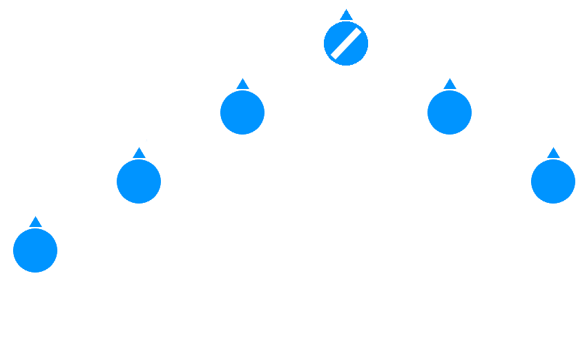
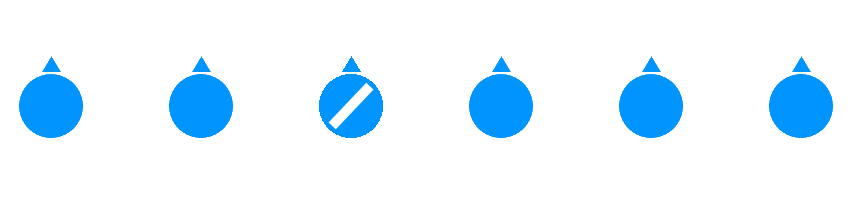
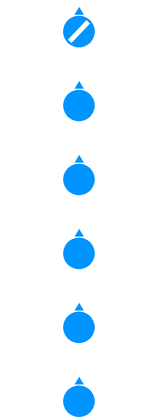
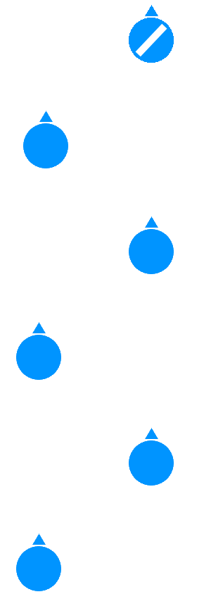

# Formacje

## Wstęp
Formacje służą do rozmieszczenia ludzi tak by jak najlepiej pod względem taktycznym wykorzystać pole obserwacji, siłę ognia i otaczający teren do wykonania zadania. Są stosowane zależnie od panującej sytuacji. Dobre rozstawienie drużyny może mieć decydujący wpływ na przebieg walki w razie nagłego kontaktu z przeciwnikiem. Ułatwiają poruszanie się i organizację, zapewniają osłonę, obserwację i koncentrują siłę ognia tam gdzie są potrzebne. Formacje są głównie stosowane na poziomie sekcji, lecz można je także stosować na poziomie drużyny i plutonu.

## Tworzenie i poruszanie się w formacji
Domyślnie dowódca kieruje formacją i ona powinna ustawiać się wokół niego. Nie należy się skupiać na tym by formacja wyglądała perfekcyjnie jak na obrazku - należy dostosowywać się do terenu i sytuacji. Dowódca powinien kontrolować szyk i zwracać uwagę gdy ktoś oddali się za daleko. Formacje najlepiej ustawiać według ustandaryzowanego wzoru:

`zwrócenie się do elementu -> nazwa formacji -> kierunek -> szczegóły dotyczące rozstawienia konkretnych jednostek`

np.

`Alpha 1, formacja klin na azymut 37, niebiescy po lewej, zieloni po prawej.`
`Alpha, formacja linia, kierunek północ, Alpha 1 na zachodzie, Alpha 2 na wschodzie.`

!> Zależnie od źródeł nazwy formacji mogą się różnić. W poradniku zostały użyte nazwy najczęściej stosowane w naszej grupie.

## Klin

Uniwersalna, łatwa w utworzeniu i utrzymaniu formacja. Pozwala na dobrą oberwacje i prowadzenie ognia na front i flanki. Łatwo ją dostosować do sytuacji. Bardzo dobra na poruszanie się po otwartym terenie.

## Linia

Linia skupia całą siłę ognia na front. Najlepiej stosowana przy szturmowaniu znanych pozycji wroga lub w określonych sytuacjach, np. ustawianiu się na granicy lasu przy drzewach.

## Kolumna

Prosta formacja, na tak zwanego "gęsiego". Ma ograniczone zastosowanie. Bardzo słaba obserwacja i siła ognia na froncie - nie powinna być stosowana gdy spodziewamy się kontaktu od przodu i przy atakowaniu wrogich pozycji. Bardzo dobra obrona z flanek - cała sekcja może szybko sie obrócić w razie zagrożenia.
Najlepiej stosowana w przypadkach:
-ograniczonej widoczności (dżungla, gęsta mgła)
-przechodzenia przez pole minowe
-poruszania się przy osłonie (murek, wzdłuż rowu, przez dolinę)

## Kolumna przestawna

Zapewnia większe pole obserwacji i siłę ognia na front niż kolumna zachowując dobrą obronę od flanek. Dobra do szybkiego poruszania się przez teren na którym nie ma wroga. Idealna do poruszania się i patrolowania wzdłuż drogi.
