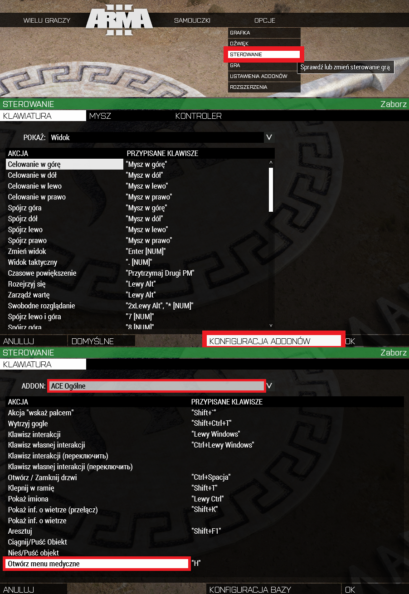
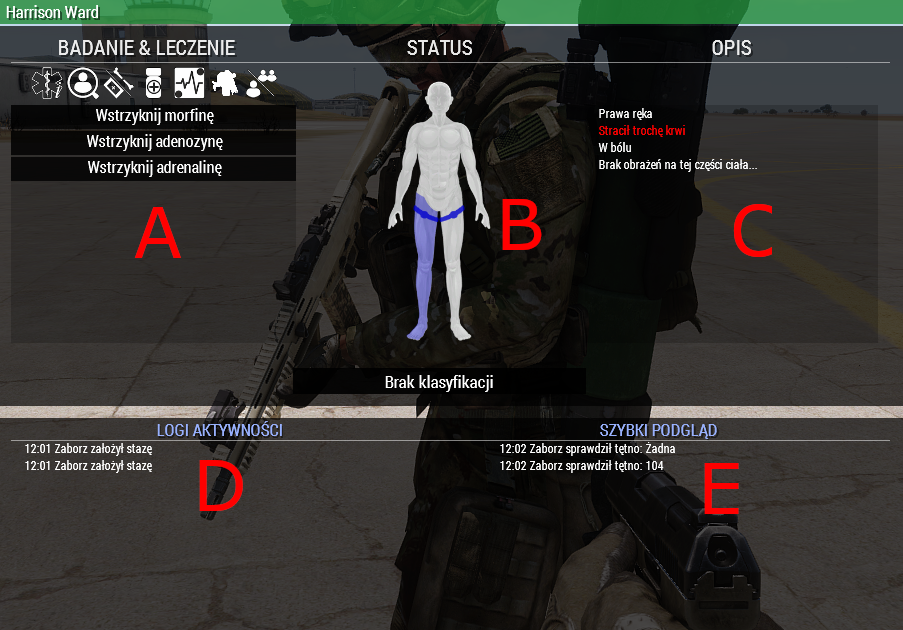
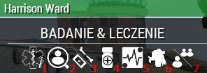
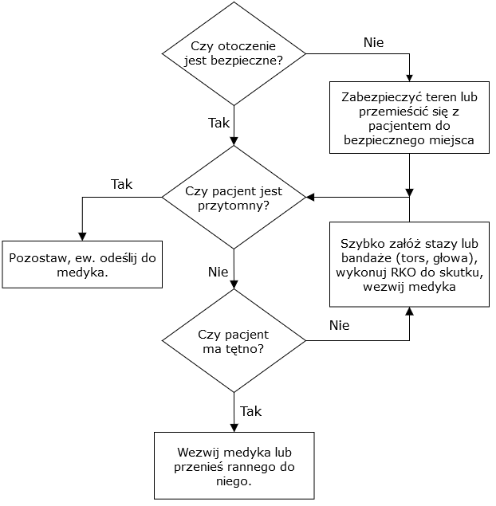
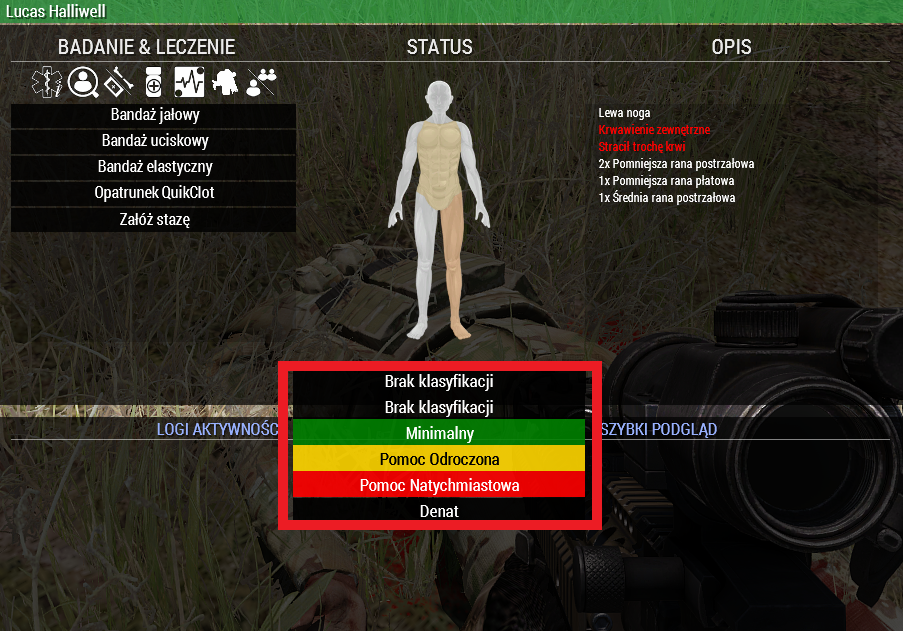
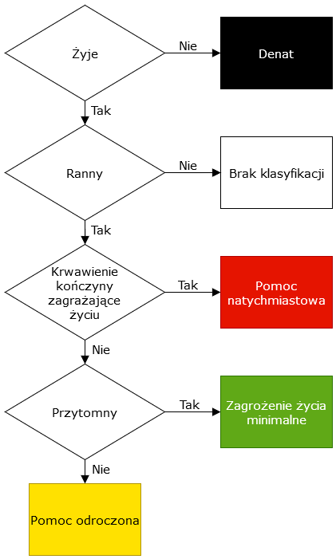
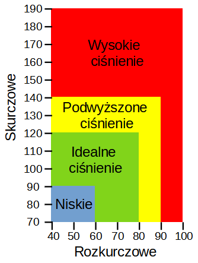
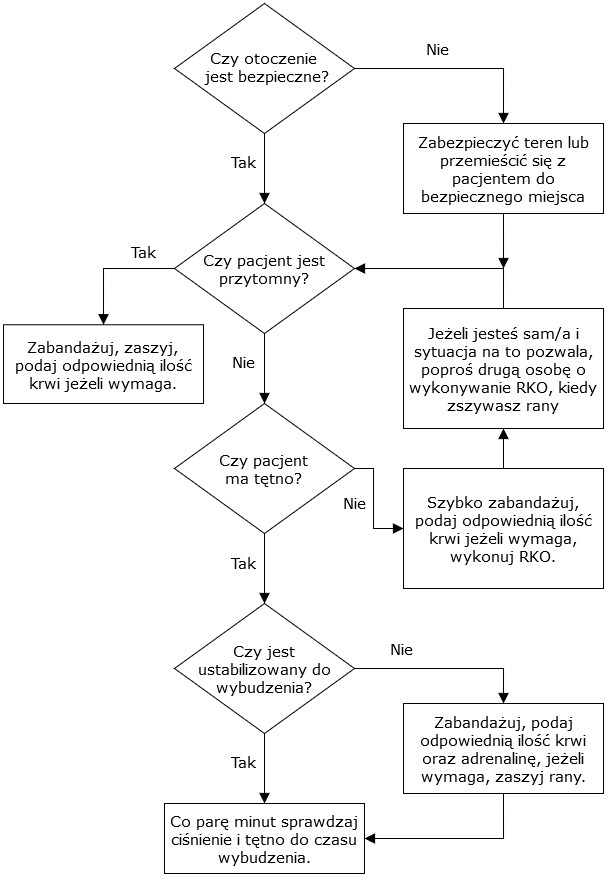

# ArmaForces - Medical

## Menu Medyczne

### Ustawienie sterowania

Do obsługi Medicala należy wpierw mieć zbindowane menu medyczne. Istnieje możliwość udzielania pierwszej pomocy za pomocą ACE, ale jest to nieporęczne. Na poniższych obrazkach przedstawiono w jaki sposób możemy zbindować szybki dostęp do menu medycznego.

### Obsługa Medicala

Po kliknięciu przypisanego klawisza (domyślnie `H`) wyświetli nam się menu medyczne nasze osoby, na którą mamy skierowany kursor i jest wystarczająco blisko. Jeśli w nikogo nie celujemy wybrana zostaje nasza postać.

- **A - Badanie i leczenie** – W tych zakładkach umieszczone są wszystkie akcje związane z czynnościami pierwszej pomocy. Poniżej przedstawiono opis każdej zakładki, zaczynając od skrajnej lewej.
- **B - Status** – Graficzny status organizmu. Im barwa danej części ciała jest bardziej czerwona, tym większe poniosła obrażenia. Niebieski kolor oznacza stłuczenie (nie da się usunąć, ale nie wpływa z znaczący sposób na organizm). Niebieskie paski oznaczają założoną stazę na danej kończynie. Możemy kolejno sprawdzać, opatrywać, podawać środki pierwszej pomocy na daną część ciała poprzez kliknięcie na dany fragment na obrazku.
- **C - Opis** – Część ciała, ilość utraconej krwi przez organizm, stopień odczuwanego bólu, wykaz ran na danej kończynie lub torsie.
- **D - Logi aktywności** – Informacje o wykonanych czynnościach np. założenie stazy, zabandażowanie rany, przetoczenie krwi itp. z podaną godziną.
- **E - Szybki podgląd** – Wyniki pomiarów ciśnienia krwi oraz tętna wraz z podaną godziną.

 1. **Karta segregacyjna** – Umieszczone są w niej niezbędne informację dotyczące podanych środków medycznych oraz staz, tj. skumulowana liczba oraz czas od ostatniej aplikacji.
 2. **Zbadaj pacjenta** – Możemy sprawdzić ciśnienie krwi oraz tętno. Tylko medyk jest w stanie dokładnie określić wynik pomiaru, tj. w wartościach liczbowych.
 3. **Bandaże/złamania** – Wyświetla wszystkie bandaże będące na wyposażeniu twoim lub kolegi, które można użyć do opatrzenia rany oraz opcję założenia/ściągnięcia stazy.
 4. **Leki** – Wyświetla wszystkie leki będące na wyposażeniu twoim lub kolegi. Adrenalinę i morfinę aplikujemy w kończyny, APAP doustnie.
 5. **Zaawansowane zabiegi** – Głównie przeznaczone dla medyka. Znajdują tu się akcje wykonania RKO tj. Resuscytacja krążeniowo-oddechowa (opcja dostępna dla wszystkich), zaszycie ran oraz przetoczenie krwi, osocza lub soli fizjologicznej.
 6. **Ciągnij/Nieś** – Możemy przeciągnąć rannego lub go przenieść na plecach. **Ciągnięcie** - szybki start, poruszamy się wolno. **Niesienie** -  wolny start, poruszamy się stosunkowo szybko. W obu przypadkach jest się bezbronnym tj. nie mamy możliwości użycia broni.
 7. **Przełącz** – Możliwość przełączenia między twoim menu medycznym a kolegi będącym w pobliżu.

## Bandaże, opaski uciskowe

Bandaże mają przypisaną skuteczność dla danej rany, aczkolwiek z racji długiego czasu na otwarcie rany po użyciu najgorszego bandaża, praktycznie nie zwraca się na to uwagi (dotyczy tylko naszej wersji systemu medycznego). Najważniejszym zadaniem jest zatamowanie krwawienia u siebie lub kolegi. Na dobór bandaża warto zwrócić uwagę w momencie kiedy nie mamy dostępu do szycia, wtedy rzadziej będą otwierać się rany.
Pamiętaj, o ile nie musisz, nie obciążaj medyka w trudnych sytuacjach. Jeśli jesteś przytomny to najpewniej możesz opatrzyć się sam. Korzystaj z pomocy medyka kiedy wiesz, że ten akurat nie zajmuje się nieprzytomnymi.

`++` = Super | `+` = Zwiększona | Brak = Standardowa

| Rana\Bandaż |       Jałowy       | Elastyczny  |  Uciskowy   |   QuikClot   |      Pol/Eng       |
| :---------: | :----------------: | :---------: | :---------: | :----------: | :----------------: |
| Draśnięcie  |         ++         |             |             |              |       Scrape       |
|   Płatowa   |                    |     ++      |             |              |      Avulsion      |
| Stłuczenie  |        N/D         |     N/D     |     N/D     |     N/D      |       Bruise       |
| Zgniecenie  |                    |     ++      |             |              |      Crushed       |
|    Cięta    |         ++         |             |             |              |        Cut         |
|  Rozerwana  |         ++         |             |             |              |        Tear        |
| Postrzałowa |         +          |      +      |     ++      |      ++      |      Velocity      |
|    Kłuta    |         +          |      +      |     ++      |      ++      |      Puncture      |
| **Pol/Eng** | **Field Dressing** | **Elastic** | **Packing** | **QuikClot** | **Dressing\Wound** |

Efektywności bandaży (w plusach) można odszyfrować zgodnie z poniższą tabelą, zawierającą:

- czas, po którym może otworzyć się rana (przedział od wartości minimalnej do maksymalnej),
- szansę, że otworzy się w tym czasie (jeśli się nie otworzy w tym czasie to nigdy się nie otworzy),
- kolejno ile ran danej wielkości można załatać jednym bandażem.

| Efektywność           |       |   +   |  ++   |
| --------------------- | :---: | :---: | :---: |
| Czas otwierania (min) | 5-10  | 6-20  | 10-30 |
| Szansa otwarcia       |  0.4  |  0.3  |  0.1  |
| Ef. Duże              |   2   |   4   |   8   |
| Ef. Średnie           |   3   |   5   |   9   |
| Ef. Małe              |   4   |   6   |  10   |

Cechy staz taktycznych:

- zakładane tylko na kończyny (ręce i nogi),
- drastycznie szybsze w użyciu od bandażowania (kupują czas medykowi na opatrzenie torsu i głowy, piechocie pozwalają na nieprzerwane prowadzenie ognia w przypadku obrażeń kończyn),
- wielokrotnego użytku - po ściągnięciu wracają do ekwipunku ściągającego,
- po kilku minutach od założenia powodują narastający ból,
- wlewy medyczne (krew, morfina) nie przynoszą efektu przy podaniu drogą zastazowanej kończyny do czasu jej zdjęcia.

**Podsumowując:**

- Rodzaj bandaża nie odgrywa takiej roli. Jeśli masz dostęp do szycia możesz bandażować się dowolnym bandażem.
- Jeżeli sytuacja nie wymaga natychmiastowej pomocy medyka, nie wołaj go. Użyj staz, zabandażuj się, wtedy zapytaj medyka czy może Ci pomóc.

## Krew

Podczas rozgrywki krew jest jednym z najcenniejszych zapasów. Z tego powodu, w miarę możliwości trzymaj przy sobie krew i uzupełniaj jej zapas, jeżeli jest taka możliwość. 0,5 - 1,0 l w twoim ekwipunku znacząco odciąży medyka oraz może Ci uratować życie, gdy zapasy medyków będą na wyczerpaniu. Jeżeli jesteś przytomny, nie potrzebujesz przetoczenia krwi do momentu pojawienia się szarego ekranu.

### Wskaźnik utraty krwi

ACE Medical ma zaimplementowany wskaźnik utraty krwi, umiejscowiony obok ikony żołnierza wskazującej akutalną posturę (prawy, górny róg ekranu). Dzięki niemu możesz orientacyjne określić, ile krwi utraciłeś bez uruchamiana menu medycznego. Stanowi on alternatywę do opisu słownego z menu medycznego, aczkolwiek z uwagi na fakt, że jest on widoczny dopiero po pierwszej utracie świadomości (wynik testów na serwerze), należy go bardziej traktować jako drugorzędną opcję. Poniżej przedstawiono wszystkie graficzne oznaczenia ww. wskaźnika wraz z przedziałem wartości litrów krwi zawartych w organiźmie żołnierza w danym momencie.

|   Krew [l]   |                             Oznaczenie graficzne                    |
| ------------ | ------------------------------------------------------------------- |
| (5,1 - 4,85) |  |
| (4,85 - 4,6) |  |
| (4,6 - 4,35) |  |
| (4,1 - 3,85) |  |
| (3,85 - 3,0) |  |

## Środki przeciwbólowe

### APAP

W razie wystąpienia bólu, zażyj APAP. Jeżeli siła bólu jest duża, zażyj 2 tabletki APAP. Praktycznie nie powoduje on skutków ubocznych (chyba że zażyjesz 10 tabletek w bardzo krótkim czasie). Jego opóźnienie w działaniu jest dłuższe, a czas działania krótszy niż morfina, aczkolwiek siła tłumienia bólu jest niewiele mniejsza od morfiny.

### Morfina

Dużą zaletą morfiny jest szybkie i długotrwałe działanie, aczkolwiek podanie jej wiąże się z obniżeniem ciśnienia krwi oraz tętna, co w przypadku znacznej utraty krwi może doprowadzić do utraty przytomności. Najważniejszą rzeczą, na którą trzeba zwracać uwagę, to odstęp między kolejnymi dawkami. Przyjęcie w czasie mniejszym niż 30 minut (czasu wirtualnego) więcej niż 2 dawek najpewniej skończy się utratą przytomności.

## Tętno i CPR

Sprawdzając tętno upewnij się że nikt nie wykonuje akurat RKO i nie sprawdzasz tętna na kończynie ze stazą.

Dla tętna przyjmuje się następujące wartości:

- Niskie – poniżej 60
- Normalne – 60 – 100
- Wysokie – powyżej 100

### Brak pulsu

Rozpocznij wykonywanie RKO (CPR). Po każdym wykonaniu sprawdź czy nie wrócił puls. Jeśli pacjentem zajmuje się więcej osób to podczas sprawdzania pulsu upewnij się, że nikt nie wykonuje RKO (CPR), ponieważ możesz wyczuć puls, kiedy tak naprawdę dalej go nie ma. Jeśli nie jesteś medykiem wykonuj RKO (CPR), aż do przybycia pomocy lub odzyskania pulsu. Każdorazowa akcja reanimacyjna wydłuża czas do śmierci.

## Słuchaj medyka

Nie bez powodu medyk jest, po SL i TL, 3 osobą w kolejności dowodzenia. To on odpowiada przez całą misję za stan zdrowotny całej drużyny. Wykonuj każde jego polecenie. Wspomagaj go, kiedy o to poprosi, ale nie stój nad nim kiedy nie ma takiej potrzeby.

## Medycy

### Triaż

W medycynie cywilnej jak i wojskowej w celu uporządkowania organizacji pomocy stosuje się tzw. triaż. Polega to na segregacji rannych według określonego schematu i przypisaniu każdemu z nich określonej klasy tj. jak szybko należy udzielić mu pomocy. Wyróżniamy triaż zwykły oraz odwrócony. Różnica między nimi jest taka, że w zwykłym udzielamy pomocy wpierw najciężej rannym, a w odwróconym najmniej rannym. To który zastosujemy zależy od sytuacji, np. czy zależy nam na uratowaniu jak największej liczby rannych czy jak najszybszym wyleczeniu pewnej liczby rannych. Z reguły odwrócony triaż stosujemy przy ciężkiej sytuacji taktycznej/ogniowej. W medicalu jest możliwość nadania klasy z triażu, aczkolwiek najważniejsze dla medyka jest uporządkowanie rannych dla siebie.

### Krew, osocze, sól fizjologiczna

W Medicalu każdy żołnierz ma 6 litrów krwi w organizmie. Każdy próg ma przypisany przedział ilości krwi występującej w danej chwili w organizmie żołnierza. Występują cztery progi:

- Stracił trochę krwi (Lost some blood) (6,0 – 5,1)
- Stracił dużo krwi (Lost a lot of blood) (5,1 – 4,2)
- Stracił bardzo dużo krwi (Lost a large amount of blood) (4,2 – 3,6)
- Stracił krytyczną ilość krwi (Lost a fatal amount of blood) (3,6 – 3,0)

Te wartości jako medyk musisz zapamiętać. Podczas rozgrywki musisz oszacować ile potrzebujesz krwi, aby ranny/ranni pod twoją opieką odzyskali zdolność bojową.

Wielokrotnie podczas rozgrywek doświadczysz jako medyk sytuacji, w której ilość krwi dostępnej do przetoczenia będzie mocno ograniczona lub nawet krytycznych sytuacjach nie wystarczająca do ustabilizowania wszystkich rannych. Oczywiście zdarzają się również sytuację, kiedy zapasów krwi jest bardzo dużo oraz jest możliwość szybkiego i bezpiecznego dostarczenia zapasów. Warto wtedy skorzystać z takiej możliwości i wlać krwi do całkowitego uzupełnienia braków. Minimalizuje to ryzyko utraty przytomności.

Przyjmuje się, że w razie uszczuplonych zapasów krew podaje się tylko nieprzytomnym lub osobom ze znaczną utratą krwi, a tym samym granicznym ciśnieniem krwi w aspekcie przytomności. Każdy członek drużyny powinien w miarę możliwość posiadać przy sobie 0,5 - 1 l krwi, co nie tylko odciąży medyka, ale również pozwoli medykowi korzystać z zapasów rannego.

W kwestii przetaczania krwi można sugerować się poniższą rozpiską, ale nie jest to sztywna zasada:

- Stracił trochę krwi - nie podajemy krwi, ponieważ w zdecydowanej większości przypadków ciśnienie krwi oraz tętno są w granicach normy
- Stracił dużo krwi - podajemy 0,5 l
- Stracił bardzo dużo krwi – podajemy 1 l
- Stracił krytyczną ilość krwi – podajemy 1,5 l

### Ciśnienie krwi i tętno

Ciśnienie oraz tętno są właściwie najważniejszymi czynnikami w Medicalu. To one są wskaźnikiem w jakim stanie jest organizm żołnierza. Rolą medyka jest rozpoznanie za pomocą pomiaru ciśnienia oraz tętna jakiej należy udzielić pomocy rannemu. Wpływ na ciśnienie oraz tętno ma mnóstwo czynników, m.in. skala utraty krwi, morfina, adrenalina, zmęczenie, ból itp.

Dla tętna przyjmuje się następujące wartości:

- Niskie – poniżej 60
- Normalne – 60 – 100
- Wysokie – powyżej 100

Wykaz czynności, które należy zastosować w zależności od ciśnienia i tętna:

- Niskie ciśnienie, tętno - Przetoczyć krew, podać adrenalinę. Jeżeli doszło do przedawkowania morfiny, podać tą samą liczbę dawek adrenaliny i odczekać.
- Wysokie ciśnienie, tętno – Podać morfinę lub adenozynę.
- Niskie ciśnienie, wysokie tętno – Przetoczyć krew.

Należy zapamiętać najważniejszy próg ciśnienia oraz tętna – 50/60, tętno 40. Od tych wartości zaczyna istnieć jakakolwiek szansa na odzyskanie przytomności.

### Leki

- Adrenalina służy do podniesienia przede wszystkim tętna, a przy tym ciśnienia krwi. W większości przypadków będzie miała ona za zadania skontrować działanie morfiny, obniżające tętno w przypadku nieprzytomnego rannego.
- Morfina jest skuteczym środkiem przeciwbólowym. Pozwala w zaledwie 30 sekund uśmierzyć ból, przez który ranny nie jest w stanie prowadzić celnego ostrzału. Skutki uboczne to obniżenie tętna oraz pośrednie obniżenie ciśnienia krwi (zmniejszona lepkość krwi).
- APAP jest alternatywą dla morfiny. Nie powoduje praktycznie żadnych skutków ubocznych, aczkolwiek jest trochę słabszy w tłumieniu bólu oraz ma dłuższe opóźnienie w działaniu. Można podawać tylko przytomnym!

| Cecha                     | Apap                   | Morfina                       |
| ------------------------- | ---------------------- | ----------------------------- |
| Maksymalny czas działania | 10 min                 | 30 min                        |
| Opóźnienie działania      | 2 min                  | 0.5 min                       |
| Siła przeciwbólowa        | 0.6                    | 0.8                           |
| Zastosowanie              | Ból u przytomnych osób | Duży ból lub u nieprzytomnych |
| Efekty uboczne            | Brak                   | Obniżone tętno                |
| Ryzyko nieprzytomności    | Pomijalne              | Wysokie, wystarczą 2 użycia   |

### Pierwsza pomoc

Pierwszą rzeczą, którą jako medyk musisz zrobić jest zapewnienie poszkodowanemu, a przede wszystkim sobie bezpiecznego otoczenia do przeprowadzenia pierwszej pomocy. Jest to najważniejsza procedura w całym ratownictwie medycznym, ponieważ udzielanie pomocy w niebezpiecznym środowisku może spowodować uszczerbek na zdrowiu osobie udzielającej pomocy, przez co potrzebne będzie zaangażowanie jeszcze większych środków, czego chcemy uniknąć.

Następnie należy sprawdzić, czy w przypadku braku przytomności ranny jeszcze ma szansę na odratowanie. Do tej pory niektórzy uważają, że ciało leżące w nienaturalnej pozycji oznacza zgon, co nie jest prawdą. Najpewniejszą na razie metodą jest próba przeniesienia rannego. Jeżeli w menu Medicala ikona do przeniesienia rannego jest szara, czyli nieaktywna, oznacza to na 100% zgon rannego (istnieje możliwość powstania aktualizacji w niedalekiej przyszłości dającą możliwość przeniesienia martwego). Jest to istotne pod względem zaoszczędzenia czasu oraz środków medycznych, tj. bandażowanie oraz resuscytacja martwego.

Kolejna rzecz to zatamowanie krwawienia. W przypadku wielu ran na kończynach, zastosuj stazę. Tymczasowo zatamuje krwawienie, co pozwoli ci na opatrzenie głowy oraz torsu. Następnie zabandażuj kończyny i najważniejsze! – ściągnij stazy. Są one wielokrotnego użytku, dlatego warto ich pilnować, żeby ktoś inny przez przypadek ich nie ukradł. Dodatkowo z czasem stazy powodują ból w wyniku nacisku powodującego niedokrwienie kończyny oraz blokują działanie adrenaliny, morfiny oraz transfuzji krwi, jeżeli zostaną podane do zastazowanej kończyny.

Po opatrzeniu ran sprawdź, czy ranny ma tętno. Jeżeli brak, wykonuj RKO do skutku. W przypadku dużej utraty krwi, przetocz krew. Po każdym wykonanym cyklu RKO sprawdź, czy pacjent odzyskał tętno. Pamiętaj, żeby nie sprawdzać go podczas wykonywania resuscytacji przez inną osobę, ponieważ otrzymasz fałszywy wynik. Tak samo kończyna zastazowana nie pokaże żadnego pulsu. Po odzyskaniu tętna, sprawdź jego wartość oraz ciśnienia krwi. Przy zbyt niskim ciśnieniu oraz tętnie, przetocz krew oraz podaj adrenalinę. Nie podawaj adrenaliny przy wysokim tętnie, ponieważ może to doprowadzić do zawału serca! Następnie zaszyj rany, na bieżąco sprawdzaj i poprawiaj funkcje życiowe do czasu wybudzenia. W momencie kiedy pacjent jest ustabilizowany, ma małą utratę krwi, ale się nie budzi, można mu podać jedną adrenalinę (epinephrine), żeby się szybciej obudził.

