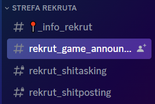
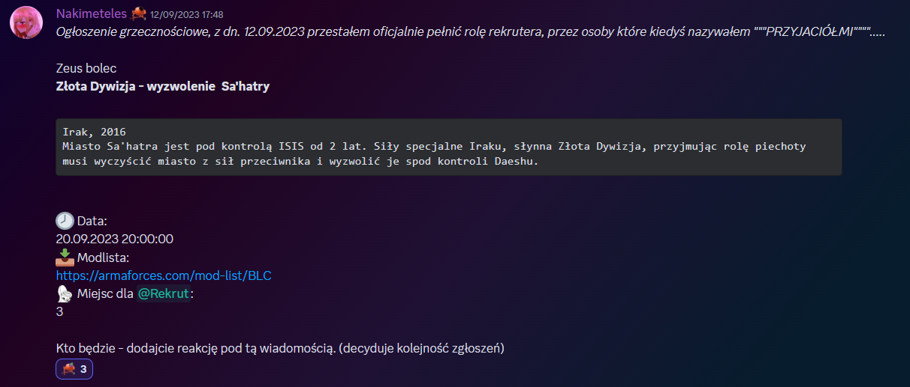
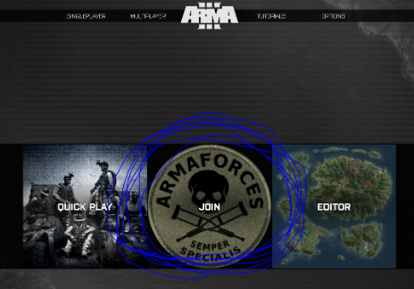
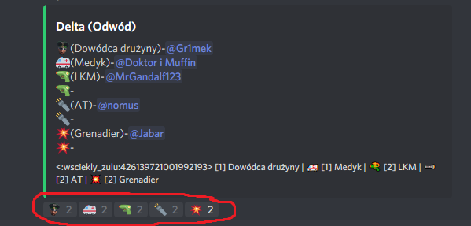

# Poradnik dla rekrutów

## Wstęp

Poradnik został opracowany z myślą o graczach dopiero rozpoczynających członkostwo w naszej grupie - jego zamiarem jest poprowadzenie was przez rękę przez wszystkie meandry konfigurowania Army i radzenia sobie z wypracowanymi wewnątrz grupy systemami, do których należą między innymi zasady zapisywania się na misję. Poszczególne kroki są dokładnie opisane, te bardziej wymagające popieramy zrzutami ekranów, znajdziecie w nim również podstawowe FAQ dotyczące zagadnień ogólnych. W razie jakichkolwiek problemów ze zrozumieniem treści poradnika kontaktujcie się ze swoimi opiekunami Rekruterami.

## *Discord Arma Forces*

### 1. Wchodzimy na Discord Arma Forces.

### 2. Wchodzimy na kanał #rekrut_game_annoucments

Obrazek orientacyjny:

### 3. Na tym kanale znajdują się zapisy na misje ze slotami dla rekrutów. Zapisy działają na zasadzie odklikania reakcji, zasady listuje rekruter wysyłający ogłoszenie. 

Przykładowe zapisy dla rekrutów:

### Misje zawsze odbywają się o 20 chyba, że zostanie inaczej powiedziane.

## Pobieranie modów

### 1. Pobieranie modów.

Klikamy na podany w zapisach link do modów, co przeniesie nas to na stronę z modlistami. Modlisty składają się z dwóch części: modów wymaganych, które potrzebne są do wejścia na serwer gdy dana modlista jest załadowana oraz modów opcjonalnych, które nie są potrzebne by rozegrać misje, lecz zawierają różnego rodzaju mody na lepsze dźwięki, dodatkowe ustawienia graficzne i tym podobne. Jesteście samemu w stanie zaznaczyć, które mody opcjonalne chcecie pobrać wraz z modlistą. Oczywiście możecie je, także w pełni zignorować, ale unikajcie dodawania ich wszystkich ponieważ część z nich się wyklucza lub w połączeniu może powodować różne błędy. Większość modów posiada krótki opis, kiedy na nie najedziecie, z którego możecie skorzystać w razie wątpliwości. Kiedy już dokonaliście wyboru klikamy przycisk "Pobierz/Download" i czekamy aż modlista się pobierze.

### 2. Importowanie modlisty

Po pobraniu modlisty wybieramy, w którym pliku chcemy ją zapisać. Następnie odpalamy launcher army i wybieramy zakładkę "mody/mods". Na zaimportowanie modlisty są dwa sposoby:
1. W zakładce mody klikamy: więcej/more po czym importuj listę modów z.../import list of mods from a file... a następnie wybieramy zapisaną modlistę.
2. Po wybraniu zakładki mody zapisaną modlistą przenosimy na launcher i puszczamy. 

W prawym górnym rogu widzimi nazwę aktualnie załadowanej modlisty. Jeśli na nią klikniemy pokaże nam się lista wszystkich zaimportowanych modlist.

**Kwestia Teamspeaka i ACRE.**

	UWAGA! Pierwsze odpalenie modów dokonujcie bez włączonego Team Speaka, żeby zainstalowało się ACRE, mod umożliwiający rozmowę w grze. UWAGA! Kiedy ACRE się zainstaluje, to pokaże się komunikat, że działa. Wtedy możemy odpalić TSa i wejść na SERWER ARMAFORCES, link jest w #_info_rekrut, tak jak WSZYSTKO, czego potrzebujecie. Serio, wystarczy przeczytać i poświęcić na to 15 sekund.

UWAGA!!! TSA I ARMĘ URUCHAMIAMY BEZ UPRAWNIEŃ ADMINA, BO NAM SIĘ ACRE WYSYPIE. Objawy wysypania to to, że plugin ACRE na TSie mamy niby odpalony, ale słyszymy wszystkich normalnie na TSie, nie przestrzennie i bez potrzeby wbijania na serwer.
Jak już gra się uruchomi i pokaże nam główne menu, klikamy na opcję Join.

Nastąpi połączenie z serwerem. Hasło powinno wejść samo, ale w razie czego jest ono na wspomianym przed chwilą kanale z informacjami dla rekrutów.

## **FAQ.**
Q: Dlaczego w zapisach nie ma podanej modlisty/nie ma jej na stronie z modsetami?

A: Najpewniej oznacza to, że do misji jest dużo czasu i autor nie przygotwał jeszcze modlisty, sprawdź ponownie bliżej terminu misji.

Q: Misja jest za 5 minut, dlaczego i tak nie ma tego do pobrania?

A: 
Wyślij zapytanie do swojego opiekuna na discordzie lub wejdź na TS na kanał “Jestem nowy i czegoś nie wiem” (duża szansa że ktoś po chwili wejdzie i spróbuje ci pomóc). Poza tym w większości przypadków te mody potrafią sporo ważyć, szczególnie jak nigdy żadnego nie pobraliście wcześniej, więc sugeruję wcześniejsze ogarnianie tych rzeczy, przynajmniej na kilka godzin przed misją. 

Q: Coś się popsuło i nie było mnie słychać (a jestem w grze), ACRE sadzi błędy

A: [Rozwiązanie problemu znajdziesz tutaj.](../troubleshooting/acre.md)

Q: Co to ACRE2 i TS?.

A: TS - TeamSpeak, taki komunikator. ACRE to plugin do TSa i mod do Army3 w jednym, który ZAWSZE ZNAJDUJE SIĘ W MODLIŚCIE, więc nie musicie się martwić, że tego nie pobraliście. Macie modlistę na misję - macie ACRE. Potrzebujecie jedynie TeamSpeaka, który jest oprogramowaniem darmowym. Zalecam pierwsze odpalenie Army z nasza modlistą przeprowadzić z wyłączonym TSem. ACRE przekopiuje sobie wtedy swoje pliki do katalogów TSa, w innym wypadku nie będzie miało do nich dostępu, bo będą używane przez włączonego TSa. 

TeamSpeaka możecie nawet odpalić w trakcie gry, ale robimy to z reguły przed lub po wejściu do lobby na serwerze. Kiedy już Zeus (Game Master) odpali misję, to automatycznie przerzuci was do odpowiedniego kanału na TSie.

ACRE symuluje komunikację jak w prawdziwości - jeżeli ktoś jest daleko, to usłyszycie go tylko jak krzyknie przy odpowiednio podregulowanej głośności. Są też radia, czyli podstawa łańcucha dowidzenia. Tutaj odsyłam do [poradnika poświęconego ACRE2](../guides/acre), gdzie znajdziecie też informacje na temat obsługi radia. Na serwerze zawsze ktoś wam z tym pomoże jeżeli poprosicie, ale przydaje się wcześniejsza świadomość istnienia takiej mechaniki.

Jeżeli macie problemy z ACRE i TS to przeczytajcie ponownie poświęconą temu część poradnika.

Q: Na stronie z modlistą świeci się na żółto jedna z paczek. Co to znaczy?

A: Że ta żółta paczka jest obecnie załadowana na serwerze. Nie uda ci się dołączyć do serwera odpalając grę z inną paczką modów, niż jest obecnie załadowana. Gra będzie sypać błędami. Paczka musi być aktualna, więc najlepiej parę godzin przed misją pobrać paczkę jeszcze raz, żeby mieć pewność, że wszystko się zaktualizowało. Raz na ruski rok mission maker zmieni zawartość paczki na chwilę przed misją (np. godzinę), wtedy jest dawany cynk na discordzie. Ale ta sytuacja dzieje się dość rzadko.

Q: Bardzo dużo teorii, a ja nie potrafię szybko czytać. Czy mogę jakoś w praktyce wypróbowac zaprezentowaną tu wiedzę?

A: Tak, serwer jest z reguły odpalony 24/7, po uzyskaniu rangi rekruta możesz normalnie popróbować wejść na serwer, jeżeli jakiś mission maker nie testuje misji, to odpalony jest default modlist (ale jak zawsze odsyłam do sprawdzenia “co się świeci” na stronie z  modlistami) na mapie Altis - można sobie pojeździć i polatać, poleczyć boty. Są spawnery tu i tam.
Zachęcam również do sprawdzenia działania ACRE/TeamSpeaka, na serwer TS też możecie wchodzić bez strachu, czujcie się jak u siebie. ACRE najlepiej przetestować z drugą osobą, poproście rekruterów lub innych rekrutów, bo może też szukają partnera/ki do testów.

Q: Ile przeciętnie trwa misja?

A: Od 1,5h do 2,5h. Jeżeli coś się wysypie - może trwać dłużej. Misje, które są JointOps z innymi grupami zazwyczaj trwają dłużej, czasem nawet do 4 godzin.

Q: Nie jestem już rekrutem, zostałem przyjęty, chcę się zapisać na misję!

A: Mission maker utworzy jakiś czas przed misją (z reguły kilka dni) tzw. zapisy na misję na naszym Discordzie. Bot (Boderator) zawoła wtedy cały serwer, więc na pewno nie przeoczysz. Każda misja ma utworzony dedykowany kanał z zapisami, gdzie zawarty jest briefing, data misji, data zamknięcia zapisów, poszczególne sekcje i role do obsadzenia. Zapisy odbywają się poprzez kliknięcie adekwatnej reakcji po daną sekcją. Reakcję klikamy raz (czasami może być lag), możemy się oczywiście wypisać przed upływem terminu końca zapisów, później pod groźbą bana na zapisy jesteśmy zobligowani stawić się na misji.

**Sekcja “Delta” i wykaz zajętych/wolnych ról. Obsadzony jest np. dowódca drużyny, ale wolne są sloty LKMisty, anti-tank, granadiera. Nasza reakcja (zapis na misję) zostanie odrzucona w przypadku próby zapisania się na dowódcę lub medyka (bo są zajęte), ale każda inna rola wciąż ma jeden “slot” wolny. W czerwonym polu klikamy ikonę interesującej nas roli.**

**Ten tutorial stanowi nowszą wersję trochę bardziej śmieszkowego tutoriala napisanego przez jednego z rekruterów - Nakimetelesa. Tamta wersja posiada kilka przestarzałych informacji, lecz wciąż jest dostępna jeżeli istnieje taka potrzeba: https://docs.google.com/document/d/1nOPqnTeu9Flph8oBtN2FFMQ5dUvwFet_Y80uH1ckp1s/edit**