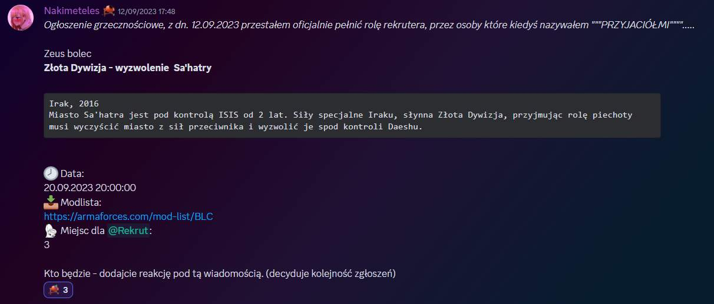

# Poradnik dla rekrutów

## Wstęp

Poradnik został opracowany z myślą o graczach dopiero rozpoczynających członkostwo w naszej grupie - jego zamiarem jest poprowadzenie ciebie za rękę przez wszystkie meandry konfigurowania Army i radzenia sobie z wypracowanymi wewnątrz grupy systemami, do których należą między innymi zasady zapisywania się na misję. Poszczególne kroki są dokładnie opisane, te bardziej wymagające popieramy zrzutami ekranów, znajdziecie w nim również podstawowe FAQ dotyczące zagadnień ogólnych. W razie jakichkolwiek problemów ze zrozumieniem treści poradnika skontaktuj się ze swoimi opiekunami Rekruterami.

## *Discord Arma Forces*

### 1. Wejdź na Discord Arma Forces

### 2. Wejdź na kanał #rekrut_game_announcements

Obrazek orientacyjny:

### 3. Na tym kanale znajdują się zapisy na misje ze slotami dla rekrutów. Zapisy działają na zasadzie odklikania reakcji, zasady listuje rekruter wysyłający ogłoszenie

Przykładowe zapisy dla rekrutów:

### Misje zawsze odbywają się o godzinie 20:00, chyba że zostanie powiedziane inaczej

## Pobieranie modów i wejście na serwer

### 1. Pobieranie modów

Kliknij na podany w zapisach link do modów, przeniesie to ciebie na stronę z modlistami. Modlisty składają się z dwóch części: modów wymaganych, które potrzebne są do wejścia na serwer gdy dana modlista jest załadowana oraz modów opcjonalnych, które nie są potrzebne by rozegrać misje, lecz zawierają różnego rodzaju mody na lepsze dźwięki, dodatkowe ustawienia graficzne i tym podobne. Jesteś w stanie sam zaznaczyć, które mody opcjonalne chcesz pobrać wraz z modlistą. Oczywiście możesz je w pełni zignorować, ale unikaj dodawania ich wszystkich, ponieważ część z nich się wyklucza lub w połączeniu ze sobą może powodować różne błędy. Większość modów posiada krótki opis, kiedy na nie najedziesz, z którego możesz skorzystać w razie wątpliwości. Kiedy już dokonałeś wyboru kliknij przycisk "Pobierz/Download" i poczekaj, aż modlista się pobierze.

Niektóre misje wymagają DLC (płatengo dodatku) do zagrania. Informacja czy i jakie DLC jest potrzebne na daną misję powinna być zawarta w opisie. Jeśli na jakąś misję jest potrzebne DLC to obok modlisty do niej znajdywać się będzie ikona danego DLC, na którą można najechać kursorem by zobaczyć jego pełną nazwę. Ikona będzie się, także pojawiać obok nazwy, kiedy wejdziemy w modlistę.

Na tym obrazku widać, że modlista Wietnam wymaga Creator DLC: S.O.G Prairie Fire.

### 2. Importowanie modlisty

Po pobraniu modlisty wybierz, w którym pliku chcesz ją zapisać. Następnie odpal launcher army i wybierz zakładkę "mody/mods". Na zaimportowanie modlisty są dwa sposoby:

1. W zakładce mody kliknij: więcej/more po czym importuj listę modów z.../import list of mods from a file... a następnie wybierz zapisaną modlistę.
2. Po wybraniu zakładki mody zapisaną modlistę przenosimy na launcher i puszczamy.

W prawym górnym rogu widać nazwę aktualnie załadowanej modlisty. Jeśli na nią klikniesz pokaże ci się lista wszystkich zaimportowanych modlist.

### 3. Włączenie gry i wejście na serwer

Teraz, kiedy już modlista jest załadowana to kliknij przycisk "GRAJ/PLAY" i arma zacznie się włączać. Kiedy już menu główne będzie załadowane na serwer dołączyć możesz w dwa sposoby:

1. Najedź na "Multiplayer", następnie kliknij na "Server browser", potem wybierz na pasku na górze "Direct connect", pojawi ci się okienko, które uzupełniasz danymi serwera i klikasz "Join".
2. Drugim, lepszy i szybszym sposobem jest kliknięcie na logo grupy z napisem "Join", które powinno ci się wyświetlać na środku menu głównego.

Następnie nastąpi połączenie z serwerem. Hasło powinno wejść samo, ale w razie czego jest ono na wspomianym przed chwilą kanale z informacjami dla rekrutów.

!> Pierwsze odpalenie modów dokonaj bez włączonego Team Speaka, żeby zainstalowało się ACRE, mod umożliwiający rozmowę w grze. UWAGA! Kiedy ACRE się zainstaluje, to pokaże się komunikat, że działa. Wtedy możesz odpalić TSa i wejść na SERWER ARMAFORCES, link jest w #_info_rekrut, tak jak WSZYSTKO, czego potrzebujesz. Serio, wystarczy przeczytać i poświęcić na to 15 sekund.

!> TS i armę włącz bez uprawnień admina, inaczej ACRE nie będzie działać. Objawy wysypania to to, że plugin ACRE na TSie mamy niby odpalony, ale słyszysz wszystkich normalnie na TSie, nie przestrzennie i bez potrzeby wbijania na serwer.

## FAQ

### Q: Dlaczego w zapisach nie ma podanej modlisty/nie ma jej na stronie z modsetami?

A: Najpewniej oznacza to, że do misji jest dużo czasu i autor nie przygotował jeszcze modlisty. Sprawdź ponownie bliżej terminu misji.

### Q: Misja jest za godzinę, dlaczego i tak nie ma tego do pobrania?

A: Wyślij zapytanie do swojego opiekuna na discordzie lub wejdź na TS na kanał “Jestem nowy i czegoś nie wiem” (duża szansa że ktoś po chwili wejdzie i spróbuje ci pomóc). Poza tym w większości przypadków te mody potrafią sporo ważyć, szczególnie jak nigdy żadnego nie pobraliście wcześniej, więc sugeruję wcześniejsze ogarnianie tych rzeczy, przynajmniej na kilka godzin przed misją.

### Q: Coś się popsuło i nie było mnie słychać (a jestem w grze), ACRE sadzi błędy

A: [Rozwiązanie problemu znajdziesz tutaj.](../troubleshooting/acre.md)

### Q: Co to ACRE2 i TS?

A: TS - TeamSpeak, taki komunikator. ACRE to plugin do TSa i mod do Army 3 w jednym, który ZAWSZE ZNAJDUJE SIĘ W MODLIŚCIE, więc nie musisz się martwić, że tego nie pobrałeś. Masz modlistę na misję - masz ACRE. Potrzebujesz jedynie TeamSpeaka, który jest oprogramowaniem darmowym. Zalecam pierwsze odpalenie Army z nasza modlistą przeprowadzić z wyłączonym TSem. ACRE przekopiuje sobie wtedy swoje pliki do katalogów TSa, w innym wypadku nie będzie miało do nich dostępu, bo będą używane przez włączonego TSa.

TeamSpeaka możesz nawet odpalić w trakcie gry, ale robimy to z reguły przed lub po wejściu do lobby na serwerze. Kiedy już Zeus (Game Master) odpali misję, to automatycznie przerzuci ciebie do odpowiedniego kanału na TSie.

ACRE symuluje komunikację głosową - jeżeli ktoś jest daleko, to usłyszysz go tylko jak krzyknie przy odpowiednio podregulowanej głośności. Są też radia, czyli podstawa łańcucha dowidzenia. Tutaj odsyłam do [poradnika poświęconego ACRE2](../guides/acre), gdzie znajdziesz też informacje na temat obsługi radia. Na serwerze zawsze ktoś ci z tym pomoże jeżeli poprosicie, ale przydaje się wcześniejsza świadomość istnienia takiej mechaniki.

Jeżeli masz jakieś problemy z [TS](../troubleshooting/ts.md) i [ACRE](../troubleshooting/acre.md) to przeczytaj poradniki poświęcone temu jak je naprawić.

### Q: Na stronie z modlistą świeci się na żółto jedna z paczek. Co to znaczy?

A: Oznacza to, że ta żółta paczka jest obecnie załadowana na serwerze. Nie uda ci się dołączyć do serwera odpalając grę z inną paczką modów, niż jest obecnie załadowana. Gra będzie sypać błędami. Paczka musi być aktualna, więc najlepiej parę godzin przed misją pobrać paczkę jeszcze raz, żeby mieć pewność, że wszystko się zaktualizowało. Raz na ruski rok mission maker zmieni zawartość paczki na chwilę przed misją (np. godzinę), wtedy jest dawany cynk na discordzie. Ale ta sytuacja dzieje się dość rzadko.

### Q: Bardzo dużo teorii, a ja nie potrafię szybko czytać. Czy mogę jakoś w praktyce wypróbowac zaprezentowaną tu wiedzę?

A: Tak, serwer jest z reguły odpalony 24/7, po uzyskaniu rangi rekruta możesz normalnie popróbować wejść na serwer, jeżeli jakiś mission maker nie testuje misji, to odpalony jest default modlist (ale jak zawsze odsyłam do sprawdzenia “co się świeci” na stronie z  modlistami) na mapie Altis - można sobie pojeździć i polatać, poleczyć boty. Są spawnery tu i tam.
Zachęcam również do sprawdzenia działania ACRE/TeamSpeaka, na serwer TS też możecie wchodzić bez strachu, czujcie się jak u siebie. ACRE najlepiej przetestować z drugą osobą, poproście rekruterów lub innych rekrutów, bo może też szukają partnera/ki do testów.

### Q: Ile przeciętnie trwa misja?

A: Od 1,5h do 2,5h. Jeżeli coś się wysypie - może trwać dłużej. Misje, które są JointOps z innymi grupami zazwyczaj trwają dłużej, czasem nawet do 4 godzin.

### Q: Nie jestem już rekrutem, zostałem przyjęty, chcę się zapisać na misję

A: Mission maker utworzy jakiś czas przed misją (z reguły kilka dni) tzw. zapisy na misję na naszym Discordzie. Bot (Boderator) zawoła wtedy cały serwer, więc na pewno nie przeoczysz. Każda misja ma utworzony dedykowany kanał z zapisami, gdzie zawarty jest briefing, data misji, data zamknięcia zapisów, poszczególne sekcje i role do obsadzenia. Zapisy odbywają się poprzez kliknięcie adekwatnej reakcji po daną sekcją. Reakcję kliknij raz (czasami może być lag), możesz się oczywiście wypisać przed upływem terminu końca zapisów, później pod groźbą tymczasowego bana na zapisy jesteś zobligowani stawić się na misji.

Na obrazku przedstawiona jest sekcja "Bravo" i wykaz zajętych/wolnych ról. W tym przypadku obsadzone są wszystkie role poza squad leaderem. Jeśli spróbujemy zapisać się na zajętą już rolę to nasza reakcja (zapis na misje) zostanie odrzucona. Kliknij ikonę interesującej ciebie roli w polu zaznaczonym na czerwono i, pod warunkiem, że nie jest już ona zajęta, twój nick pojawi się obok niej w zapisach.

Ten tutorial stanowi nowszą wersję trochę bardziej śmieszkowego tutoriala napisanego przez jednego z rekruterów - Nakimetelesa. Tamta wersja posiada kilka przestarzałych informacji, lecz wciąż jest dostępna jeżeli istnieje taka potrzeba: <https://docs.google.com/document/d/1nOPqnTeu9Flph8oBtN2FFMQ5dUvwFet_Y80uH1ckp1s/edit>
