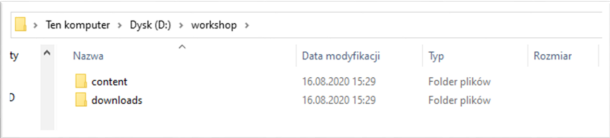
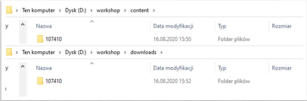
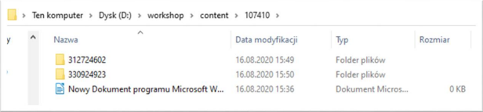
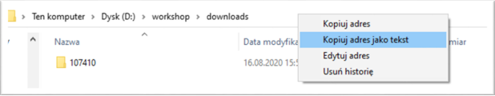
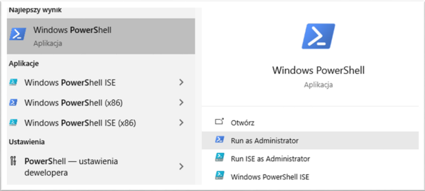
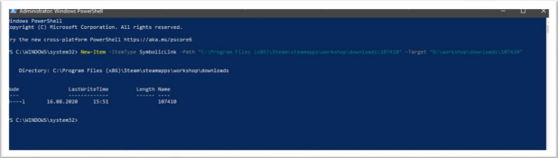
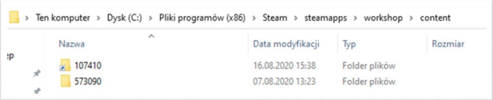
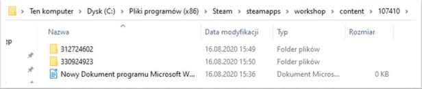

# Symlinki

## Wstęp

Poradnik został opracowany z myślą o graczach, którzy chcieliby zaoszczędzić precjozo jakim jest wolna przestrzeń na ich dyskach SSD, ale wciąż posiadać Armę na swoim szybszym dysku. Pokazuje on jak osiągnąć zamierzony cel przerzucając często spore paczki modów na dysk HDD i tworząc do nich linki. Twórcą poradnika jest @Renchon. 

  [Symlink - ArmA SSD, mody HDD](https://drive.google.com/file/d/1lWbsHtAd6JXc7X-ZiMUpWLUAMQwwKrw9/view)

Symlink 101 dla ludzi, którzy kończyli podstawówkę, nie informatykę - czyli jak
mieć mody z Army 3 na HDD gdy gra jest na SSD.

Dysk C – SSD | Dysk D – HDD

Wyłączamy Steam!
Następnie dysku HDD tworzymy foldery (dwa, ponieważ download i content), w którym
chcielibyśmy mieć mody do naszej ukochanej gry Army 3. Dla uproszczenia ja mam po
prostu nazwane foldery i ścieżkę tak samo jak w oryginalnym katalogu steam.
Pamiętaj, że ostatni folder 107410 nie może mieć zmienionej nazwy!

W każdym z folderów 107410 w katalogu content i downloads tworzymy puste pliki tekstowe z
losową nazwą (dla sprawdzenia czy całość działa)

Posiadając już zrobiony katalog na dysku HDD, przystępujemy do skopiowania adresu folderów z
dysku SSD i HDD

Dokonujemy tego odpowiednio dla ścieżek SSD downloads/107410 ; content/107410 i vice-versa dla
HDD
Ostatecznie nasze ścieżki powinny wyglądać tak jak poniżej: (Oczywiście trzeba pamiętać o różnicy w
nazwaniu folderów.

C:\Program Files (x86)\Steam\steamapps\workshop\content\107410
C:\Program Files (x86)\Steam\steamapps\workshop\downloads\107410

D:\workshop\content\107410
D:\workshop\downloads\107410

Następnie wyszukujemy programu Windows PowerShell i przytrzymując Shift + Ctrl klikamy na niego
Enter – To powinno odpalić go w trybie administracyjnym. [Musi być odpalony z prawami
administratora]

New-Item -ItemType SymbolicLink -Path "Link" -Target "Target"
Jest komendą używaną do symlinku – w miejscu Link (pomiędzy znakami cudzysłowia)
dajemy ścieżkę do dysku SSD a w miejscu Target to SSD. Oznacza to, że na dysku SSD tworzy się
<mydło zredaguj xD> którego celem jest dysk HDD.
W przypadku moich wyżej podanych ścieżek komenda będzie wyglądała tak:

New-Item -ItemType SymbolicLink -Path "C:\Program Files
(x86)\Steam\steamapps\workshop\content\107410" -Target
"D:\workshop\content\107410"

New-Item -ItemType SymbolicLink -Path "C:\Program Files
(x86)\Steam\steamapps\workshop\downloads\107410" -Target
"D:\workshop\download\107410"

Podajemy komendę i ją wykonujemy, powinno wyskoczyć nam coś takiego dla obydwu.

A same foldery (już w ścieżce SSD) powinny wyglądać tak (czyli mieć ikonkę skrótu):

Gdy wejdziemy akurat w ten folder, to powinniśmy zobaczyć znajome pliki

Podobnie powinien wyglądać folder w katalogu downloads

Możemy teraz włączyć Steam i zacząć pobierać mody

Troubleshooting [Na tą chwilę problemy z którymi się spotkałem]
1. Wyskakuje mi komenda, że się nie da bo coś źle
Trzeba sprawdzić czy ścieżka katalogu jest prawidłowa

2. Jak klikam enter to komenda się nie wykonuje
Kliknij LPM na koniec komendy, aby znaczek od pisania był na końcu, jak
jest gdzieś indziej to komenda może się nie wykonywać (sam się na tym
naciąłem)

3. Folder pozostaje taki sam, nic się nie zmienia
Można spróbować usunąć folder 107410 (downloads i content) z SSD i
wykonać komendę - nie trzeba zmieniać jej treści

4. Jak mi się mody ściągają to folder 107410 na SSD zamienia się z
powrotem w zwykły w katalogu downloads.
Wyjebać wszystko co w środku, wyłączyć steama! jeszcze raz i
symlinkować ponownie
